## What you will get from this deck

- One day soon, someone may ask, or tell, you how well the ads worked
- After reading, you will be able to:
  - Identify incentive conflicts in the advertising supply chain
  - Describe pros & cons of major advertising measurement methods
  - Understand how multiple methods may be productively combined to optimize spending allocations under a budget
- This knowledge can help you balance maximizing advertising profits with returning profits to shareholders

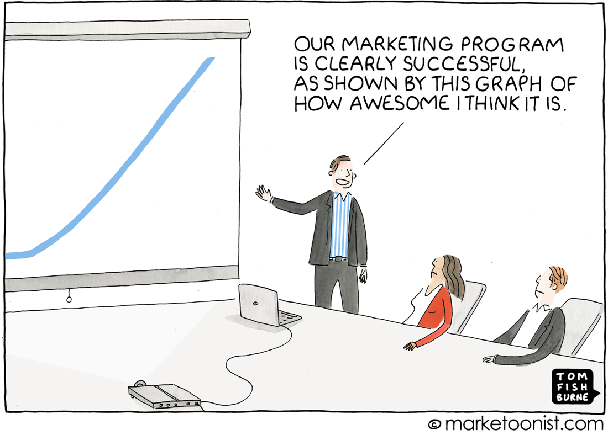{.absolute bottom="5" left="388" height="196"}

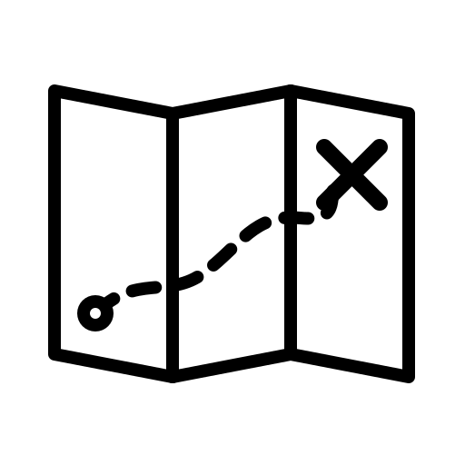{.absolute bottom=15 right=15 height="110px"}

# Domain Knowledge

- Context required to interpret advertising measurement

## Advertising sales revenue, 1950-2019

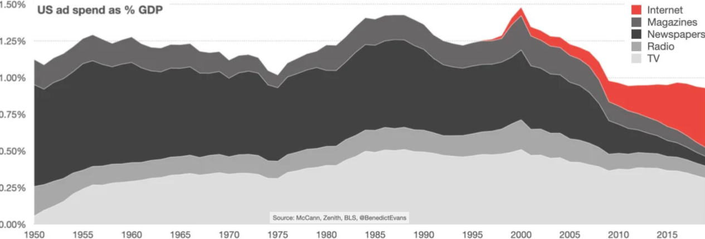{fig-align="center" height="350px"}

::: {.callout-note appearance="minimal"}
For 70 years, between $0.95-1.50 of every $100 spent in America bought an ad. These figures report advertising sales revenue to publishers (i.e., entities that attract and sell consumer attention) and exclude supply chain fees (e.g., ad agencies), which are considerable. What else do you see?
:::

::: {.source-url}
[Evans (2020)](https://www.ben-evans.com/benedictevans/2020/6/14/75-years-of-us-advertising){target="_blank"}
:::

::: notes
Around 1 out of every \$100 spent in the US buys an ad. Appears to tally ad seller revenues, excluding ad supply chain fees.
:::

## Online Ad Revenues, 2021-2025

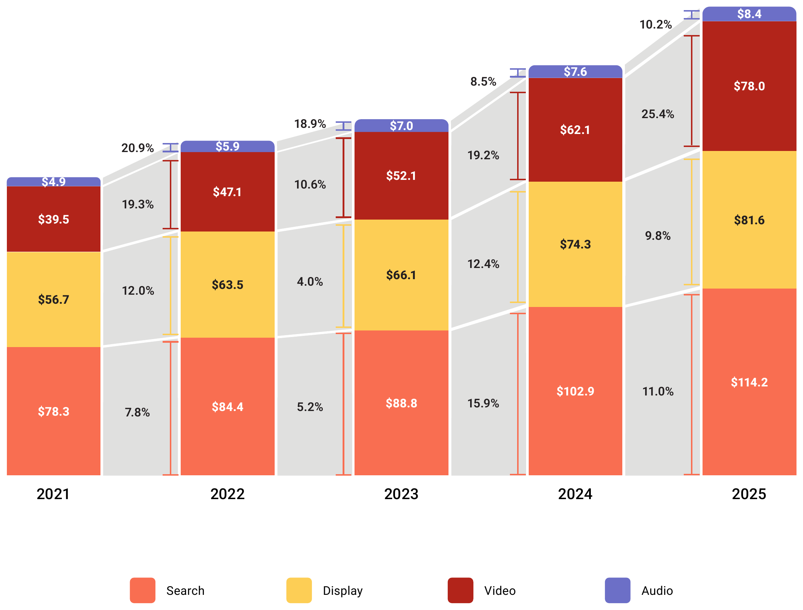{fig-align="center" height="400px"}

::: {.callout-note appearance="minimal"}
These data expand the Internet bar. The Interactive Advertising Bureau collects ad sales revenue by format from online ad sellers and supply chain firms. Total spending grew from $179.4B in 2021 to $282.2B in 2025, 0.92% of GDP. What else do you see?
:::

::: {.source-url}
[IAB (2026)](https://www.iab.com/wp-content/uploads/2026/04/IAB_PwC_Internet_Ad_Revenue_Report_Full_Year_2025_April_2026.pdf){target="_blank"}
:::

::: notes
Revenue growth remains substantial
:::

## Large Ad Seller Revenues as % of US GDP, 2011-2025 {.callout-sm}

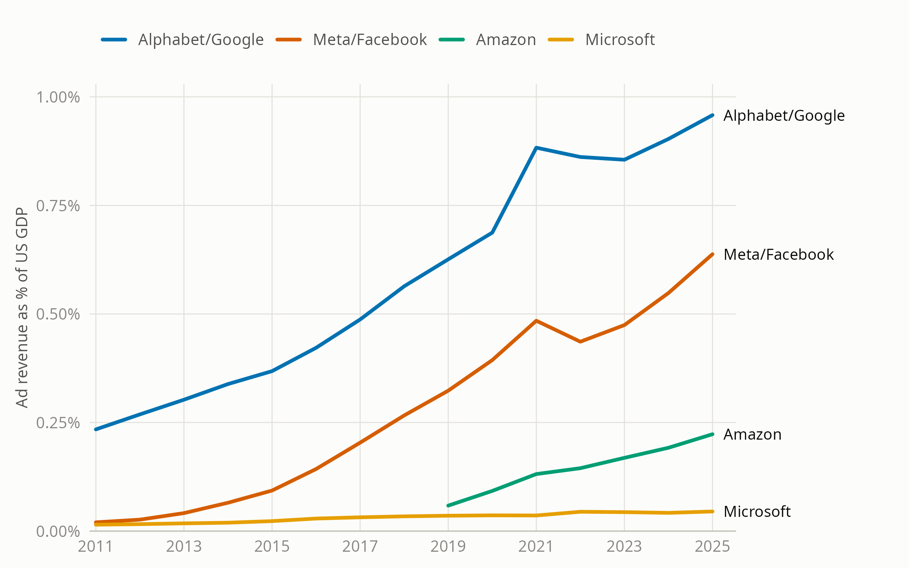{fig-align="center" height="350px"}

:::: {.callout-note appearance="minimal"}
Online advertising sales are increasingly dominated by a few large firms; the top 3 sold $559.5B in ads globally in 2025. We used to call them "the duopoly," but now we call them "the triopoly."

::: {.fig-note}
The numerator is advertising revenue only, not total company revenue. Each firm reports it as a separate line in its 10-K revenue note — Alphabet's "Google advertising" (Search & other, YouTube ads, Google Network), Meta's "Advertising," Amazon's "Advertising services," and Microsoft's "Search and news advertising." In 2025 those lines were 73%, 98%, 10% and 5% of each firm's total revenue, so the chart is not a ranking of company size. The denominator is US nominal GDP. Amazon's line starts at its first disclosure (2019); Microsoft is plotted at June fiscal years; its FY2014–15 points are inferred from growth rates disclosed in those years' 10-Ks, which reported no levels.
:::
::::

::: {.source-url}
Data: company 10-K filings; BEA NIPA Table 1.1.5. Chart concept: [Marto and Le (2024)](https://www.stlouisfed.org/on-the-economy/2024/oct/rise-digital-advertising-economic-implications){target="_blank"}
:::

::: notes
:::

## Large Ad Seller Profit Percentage, 2011-2025 {.callout-sm}

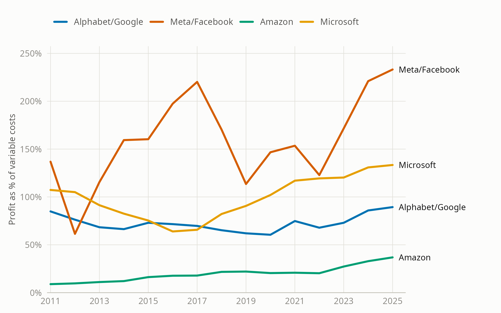{fig-align="center" height="350px"}

:::: {.callout-note appearance="minimal"}
Online advertising sales is a remarkably high-margin line of business, in part due to limited marginal costs, high efficiencies, and supply-side concentration. Note, these percentages are across all lines of business. What might these profit margins indicate to ad buyers?

::: {.fig-note}
Profit percentage = (revenue − variable costs) ÷ variable costs, where variable costs are cost of goods sold plus selling, marketing, and general and administrative expense. R&D is excluded. Computed across all lines of business, not advertising alone.
:::
::::

::: {.source-url}
Data: company 10-K filings. Chart concept: [Marto and Le (2024)](https://www.stlouisfed.org/on-the-economy/2024/oct/rise-digital-advertising-economic-implications){target="_blank"}
:::

::: notes
Selling ads is a high-margin business for some companies, compared to other services
:::

## Toy economics of advertising {.smaller}

- Suppose we pay \$10 to buy 1,000 digital ad OTS. Suppose 3 people click, 1 person buys.
- Ad profit > 0 if transaction margin > \$10
    - But we bought ads for 999 people who didn't buy
- Or, ad profit > 0 if CLV > \$10
    - Long-term mentality justifies increased ad budget
- Or, ad profit > 0 if CLV > \$10 *and* if the customer would not have purchased otherwise
    - This is "incrementality"
    - But how would we know if they would have purchased otherwise?
- Ad effects are subtle--typically, 99.5-99.9% *don't* convert--but ad profit can still be robust
    - Ad profit depends on ad cost, conversion rate, margin ... and how we formulate our objective function
    - Exception: Search ads may convert at 1-10+%, but incrementality questions are even bigger

::: notes
How important is that incrementality point?
:::

## Right ad, right person, right context, right time? {.smaller}

- Imagine you're selling mortgages. Mortgage lenders offer numerous loans at distinct price points. Yet 78% of consumers say they only apply to a single lender/broker for a quote ([FHFA 2024](https://www.fhfa.gov/sites/default/files/2024-06/v50-Appendix-C.pdf){target="_blank"}), and most borrowers actively seek a loan for only a few days or less
- To advertise profitably, you may need to find people who
    - Can qualify for a loan
    - Actively want to buy a new home
    - Are thinking about the finance process
    - Have not signed a loan yet
- Predicting which consumers to reach is necessary but insufficient. You also have to identify the brief window of time when an ad might shift each borrower's behavior, and reach them in a context where they might act on your message

::: {.callout-note appearance="minimal"}
Even a perfectly efficient and omniscient advertising industry might struggle to learn how to optimize advertising delivery. What behavioral or contextual signals might indicate mortgage loan receptivity? How much more cost-effective would these targeting signals make the ads?
:::

{.absolute right=30 top=190 height="185px"}

## AI Trades Online Ads

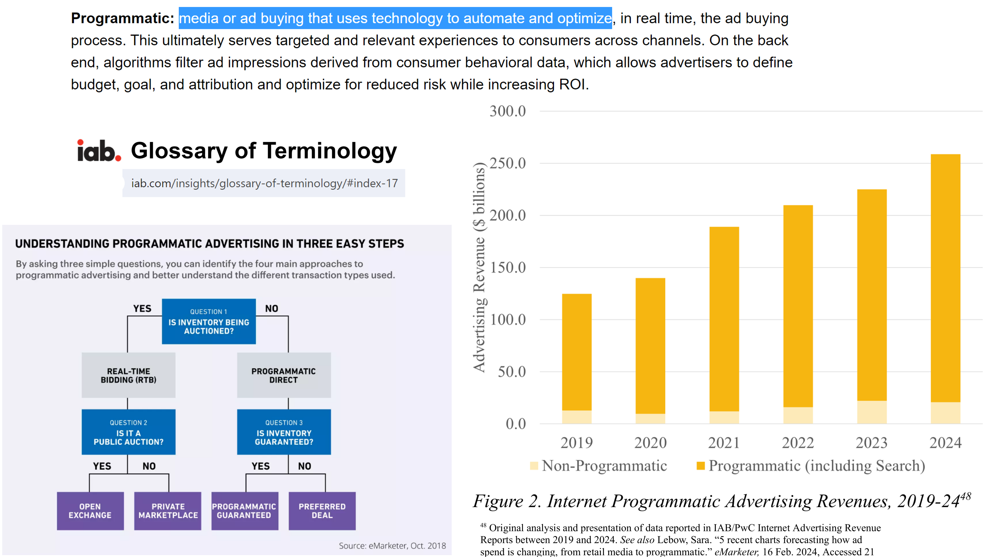{fig-align="center" height="405px"}

::: {.callout-note appearance="minimal"}
Advertising was the second industry to automate trading, after finance. 'Programmatic' methods are defined by automation and optimization. Over 90% of online advertising revenue flows through Programmatic channels, in which buyers and sellers are both represented by computerized agents. What is being automated and optimized, and for whose benefit?
:::

::: {.source-url}
[IAB Glossary of Terms (requires free registration)](https://www.iab.com/insights/glossary-of-terminology/){target="_blank"}
:::

::: notes
The automation benefit is pretty obvious, as it speeds things up compared to manual processing. The optimization is less obvious but likely even more consequential, as algorithms can be designed to incorporate automated test-and-learn strategies using conversion data.
:::

## The Ad Tech Ecosystem

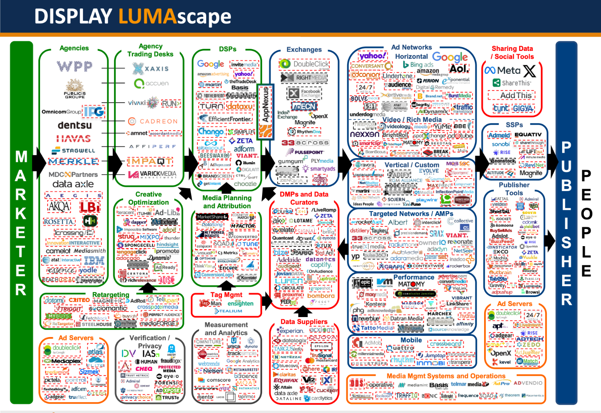{fig-align="center" height="405px"}

::: {.callout-note appearance="minimal"}
Luma Partners maps ad tech ecosystems. Each logo is a company that intermediates between advertisers and publishers: data/algorithm specialists, representatives, and marketplaces. This map is one among many. Contrast this with "walled gardens," which vertically integrate ad sales, creation, targeting, delivery & measurement.
:::

::: {.source-url}
[Luma Partners](https://lumapartners.com/lumascapes/){target="_blank"} | [Non-triopoly was just under half of US ad revenue in 2025](https://www.linkedin.com/posts/vladhanzlik_many-people-assume-amazon-google-and-meta-activity-7439279754484183041-cN9B/){target="_blank"}
:::

::: notes
Let's talk through how some of this works.
:::

## Google Performance Max

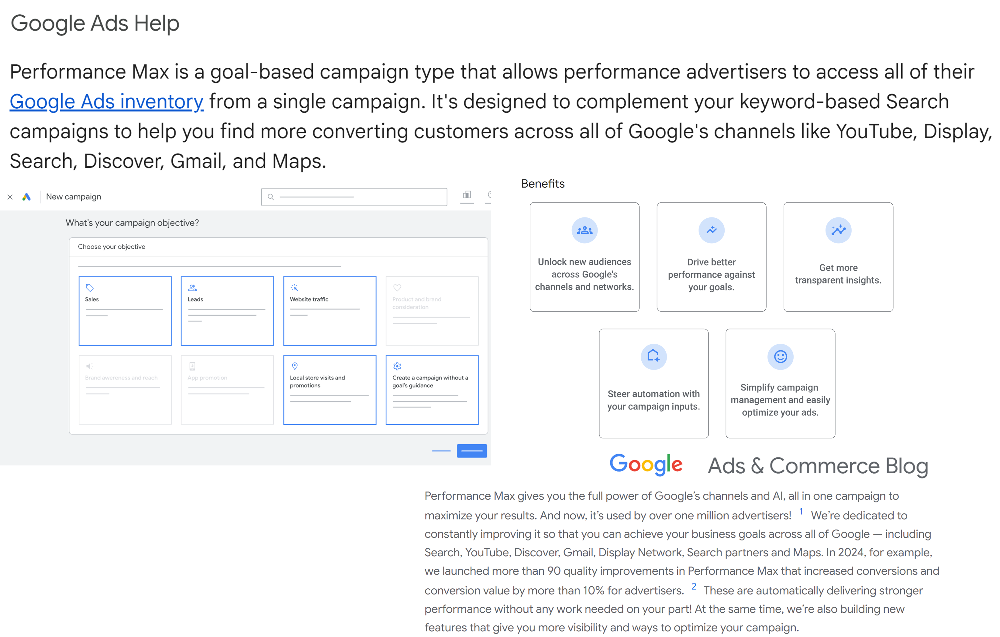{fig-align="center" height="400px"}

::: {.callout-note appearance="minimal"}
Google Pmax is the ultimate expression of programmatic advertising. You give Google your goals, your budget, and things it can say in ads. Google decides where, when and how to spend your money, designs your ad, then tells you how well it did. Launched in 2021; over 1 million advertisers served by 2025. Meta's Advantage+ is similar.
:::

::: {.source-url}
[Google](https://support.google.com/google-ads/answer/10724817?hl=en){target="_blank"}
:::

::: notes
Don't sweat the details!
:::

## The "Ad Tech Tax"

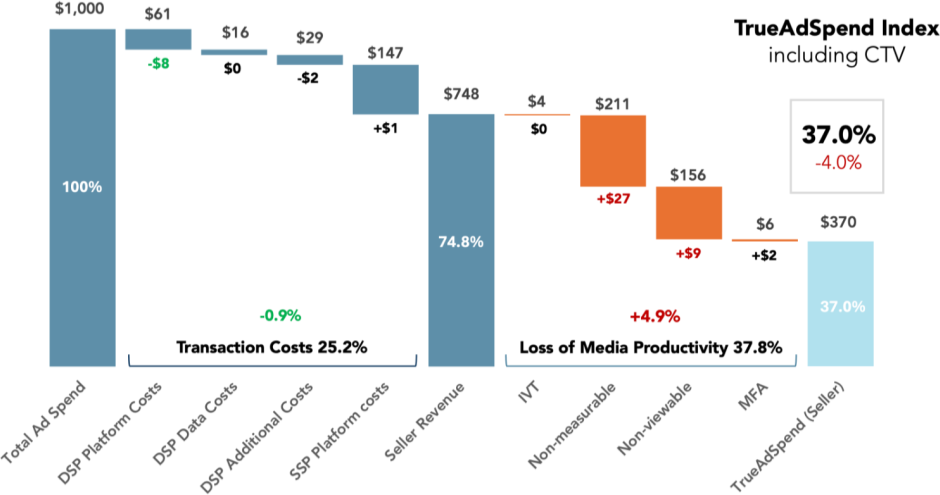{fig-align="center" height="400px"}

::: {.callout-note appearance="minimal"}
2025Q2 data show that DSP takes 11%, SSP takes 15%, publisher receives 75%, and about half of that is verifiably viewable by human recipients. What are DSP, SSP, IVT, Measurable, Viewable, [MFA](https://deepsee.io/blog/2-tales-one-site-how-arbitrage-sites-manipulate-metrics){target="_blank"}?
:::

::: {.source-url}
[ANA/TAG (2025)](https://drive.google.com/file/d/1nIjjxWAXCRpA6s9WFikBlA-UvMOlqBNA/view?usp=sharing){target="_blank"}
:::

::: notes
Let's talk about the major players.
:::

## Effective Frequency

:::: {.columns}

::: {.column width="60%"}
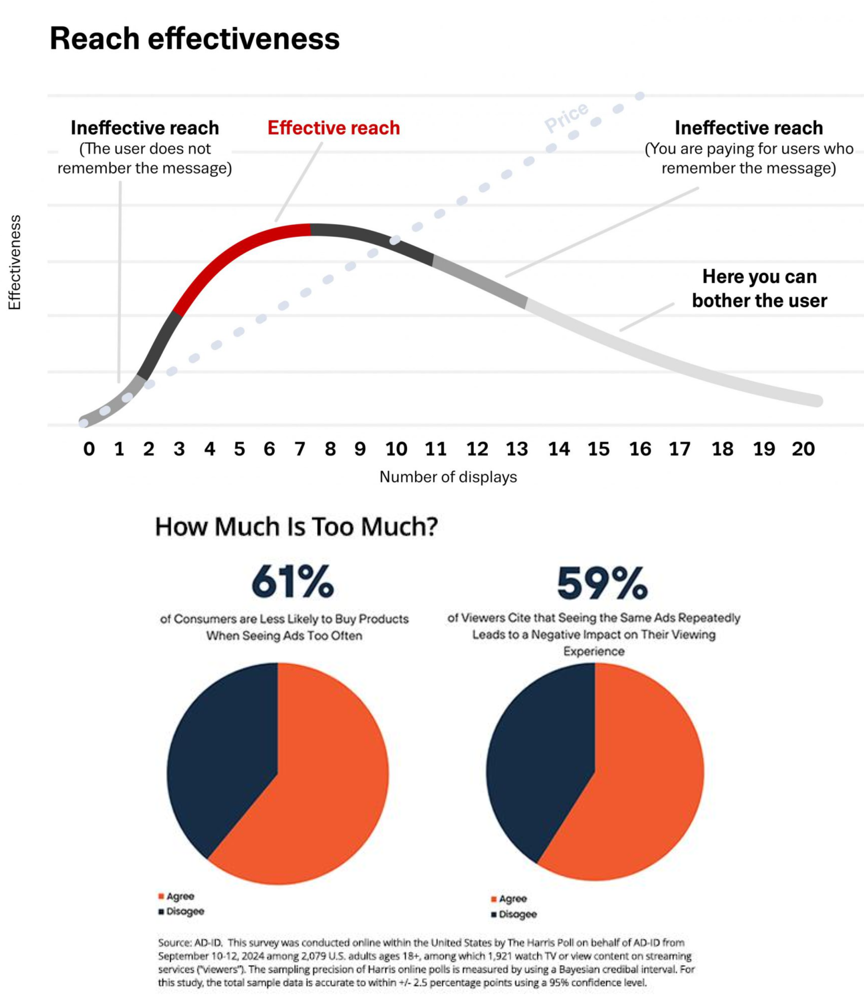{fig-align="center" height="506px"}
:::

::: {.column width="40%"}
::: {.callout-note appearance="minimal"}
Have you ever had an ad "follow you around"?

Age-old advertising theory posits a nonlinear effective frequency curve, which is to say, the marginal effect of an ad on conversion probability depends on how many times the consumer sees the ad.

Why is effectiveness convex for exposures 1-3?

Frequency Capping limits ad exposures per individual. Retargeting targets consumers based on past actions (e.g., product detail pageviews, add-to-cart)
:::
:::

::::

::: {.source-url}
[Seznam (2023)](https://blog.seznam.cz/en/2023/01/how-to-find-the-ideal-frequency-in-branded-campaigns/){target="_blank"}
:::

::: notes
:::

## Advertising avoidance

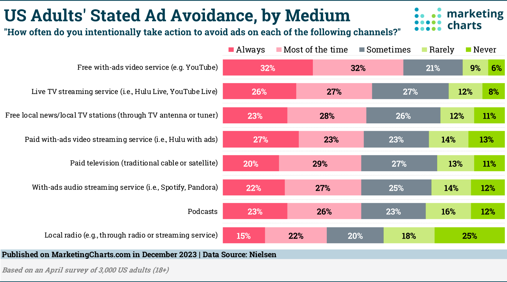{fig-align="center" height="375px"}

::: {.callout-note appearance="minimal"}
Can an ad work if a consumer avoids it? About half of consumers say they usually or always skip ads. Do you use an ad blocker in your favorite browser? *Soft* ad blockers, like AdBlock and AdBlock Plus, make money by charging publishers for NOT blocking "Acceptable Ads." *Hard* ad blockers, like uBlock Origin and AdGuard, block all ads and make money with a freemium strategy or they forego revenue.
:::

::: {.source-url}
[Nielsen (2023)](https://drive.google.com/file/d/11yit6N_5kxMTQSM6HLNP2nL0sAtXHlNY/view?usp=drive_link){target="_blank"} | [Coalition for Better Ads (2024)](https://www.betterads.org/blog/ad-blocking-growing-what-should-you-do-about-it){target="_blank"} | [Best Ad Blockers](https://www.techradar.com/pro/best-ad-blockers){target="_blank"}
:::

::: notes
:::

## Consumer Attention by Medium {.tight-media}

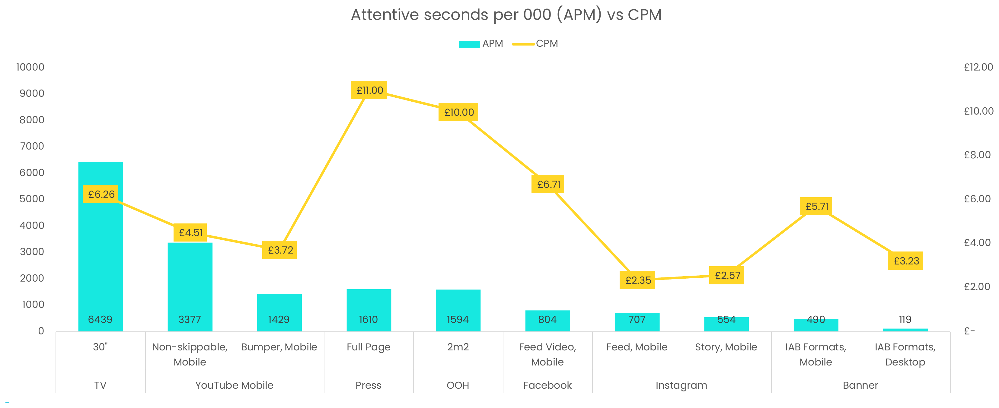{fig-align="center" height="380px"}

:::: {.columns}

::: {.column width="72%"}
::: {.callout-note appearance="minimal"}
Advertising media vary in average attention attracted (i.e. eyes-on-screen) and advertising price.
:::
:::

::: {.column width="28%"}
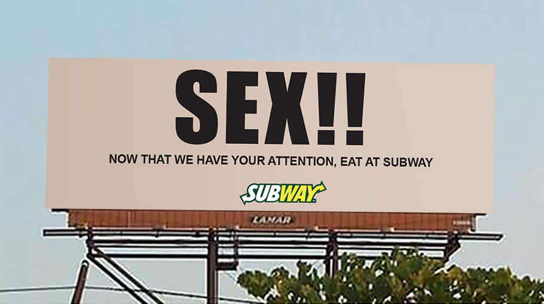{fig-align="center" height="120px"}
:::

::::

::: {.source-url}
[Lumen & TVision (2021)](https://www.mrg.org.uk/presentations/Lumen%202nd%20Feb%20MRG.pdf){target="_blank"}
:::

## Privacy Perceptions

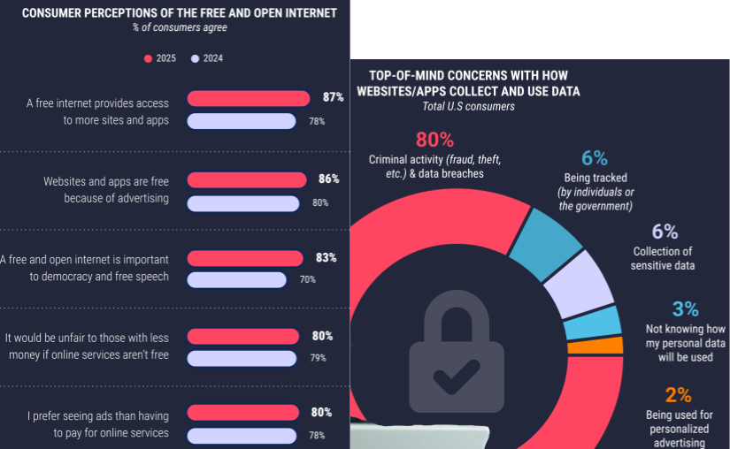{fig-align="center" height="350px"}

::: {.callout-note appearance="minimal"}
Consumers don't love ad interruptions, but most understand that advertising is the "attentional price" that subsidizes media access, which would otherwise cost more; most consumers prefer to pay with attention rather than money. Personalized advertising ranks low on most consumers' data privacy concerns. Empirical studies usually show that personalized ads generate more conversions because they are more relevant.
:::

::: {.source-url}
[IAB (2025)](https://drive.google.com/file/d/1Xzv2-kTMoJAnYsxXzLeYork_tXHbQWbb/view?usp=drive_link){target="_blank"} | [Browser Fingerprinting (2025)](https://kevinboone.me/fingerprinting.html){target="_blank"} | [Yeo et al. (2025)](https://drive.google.com/file/d/1PAQW_dAuBzny3JG4oBWXHLF_4T0GmerP/view?usp=drive_link){target="_blank"}
:::

## Commerce Media

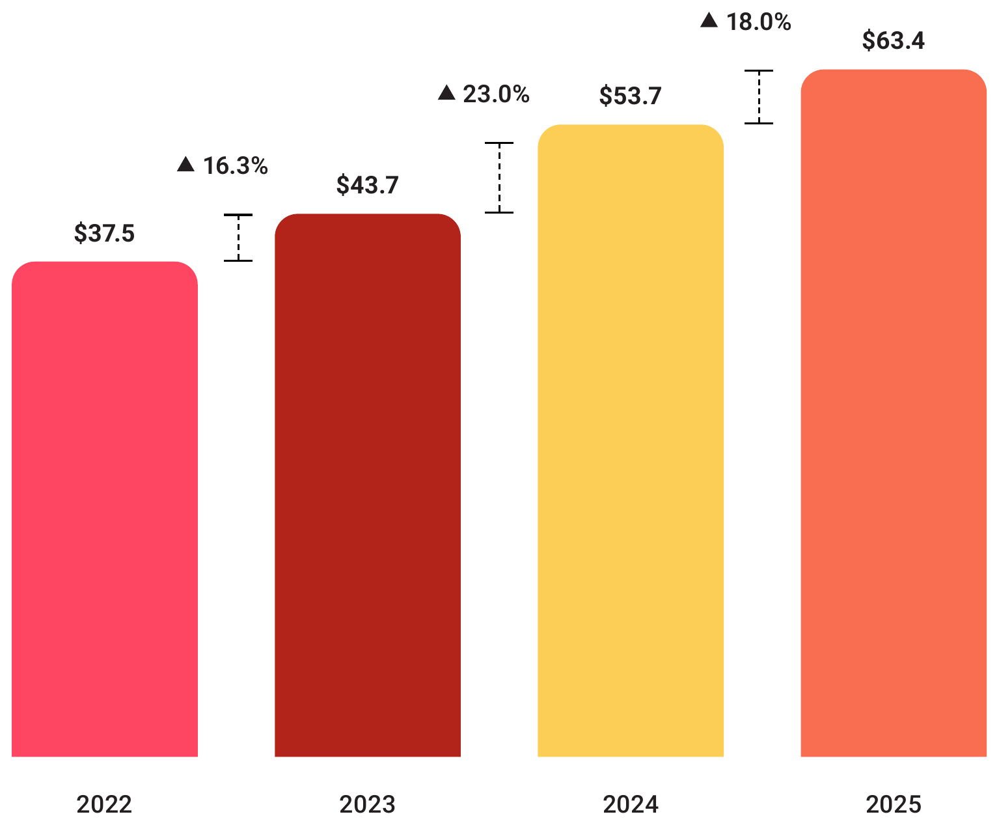{fig-align="center" height="400px"}

::: {.callout-note appearance="minimal"}
Commerce media (e.g., Amazon, Walmart) provide data for ad targeting, sell sponsored product search listings, sell ads on behalf of publishers, and measure advertising conversions. They grew quickly by cannibalizing trade promotions budgets.
:::

::: {.source-url}
[IAB (2026)](https://www.iab.com/wp-content/uploads/2026/04/IAB_PwC_Internet_Ad_Revenue_Report_Full_Year_2025_April_2026.pdf){target="_blank"} | [Gabel et al. (2024)](https://archive.ph/WfdAc){target="_blank"}
:::

::: notes
Big examples include Amazon and Walmart among others
:::

##

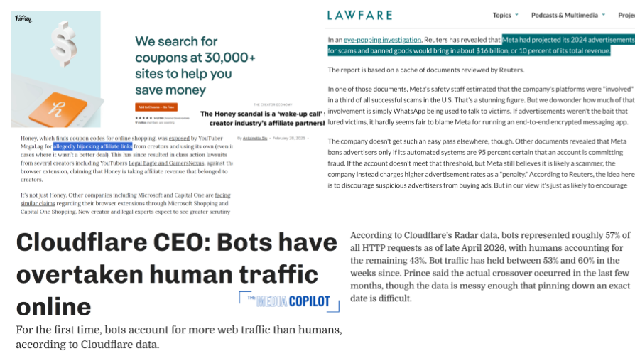{fig-align="center" height="420px"}

::: {.callout-note appearance="minimal"}
Advertising value delivered is hard to detect, but advertising remains lightly regulated, so fraud is a first-order issue. 3 main types: Fraudulent ads delivered to consumers; fraudulent audiences increasing brand payments to publishers/supply chain (e.g., [MFA](https://www.ana.net/content/show/id/pr-2023-09-made-for-advertising){target="_blank"}); and supply-chain participants stealing from each other. Verification firms (e.g., Integral Ad Science) try to detect problems but high-profile failures have occurred. Career professionals believe fraud funds organized crime and hostile governments.
:::

::: {.source-url}
[MegaLag (2024)](https://www.youtube.com/watch?v=vc4yL3YTwWk){target="_blank"} | [Lawfare (2026)](https://web.archive.org/web/20251212085545/https://www.lawfaremedia.org/article/reuters-blows-lid-on-meta%27s-fraud-profit-scandal){target="_blank"} | [Media Copilot (2026)](https://web.archive.org/web/20260724031653/https://mediacopilot.ai/bots-passed-human-traffic-online-cloudflare-ceo/){target="_blank"} | [OfCom (2026)](https://web.archive.org/web/20260721084022/https://www.ofcom.org.uk/siteassets/resources/documents/research-and-data/online-advertising/fraudulent-advertising-and-account-integrity_expert-insights-on-best-practice.pdf?v=422303){target="_blank"} | [Adalytics](https://adalytics.io/blog){target="_blank"}
:::

::: notes
- Note the "17 million members" and the Paypal ownership
- Honey had two major problems. First, its pitch to consumers appears misleading, as it enabled stores to pay fees to manage the coupon codes available to consumers, and thereby avoid margin erosion. Second, it was replacing influencers' affiliate codes with its own, meaning it was allegedly stealing affiliate marketing fees from its own partners.
- One reason causality is important is that, if we assume all marketing is incremental, we will maximize our unproductive payouts and thereby decrease our advertising ROAS
:::

## Brand Safety and Suitability

- **Brand safety:** Protect brands against negative impacts on consumer opinion from ads appearing near specific types of content
    - E.g., proximate to military conflict, obscenity, drugs, hate speech
    - Keyword blacklists and whitelists determine contextual ad bids; blacklists [demonetized >50% of Reuters.com news articles](https://web.archive.org/web/20260516091129/https://www.adexchanger.com/publishers/keyword-blocking-demonetized-more-than-half-of-reuters-brand-safe-stories/){target="_blank"}
    - Ad platforms have seen "advertiser boycotts" demanding content moderation improvements; monetization is [expanding recently](https://www.tubefilter.com/2026/01/15/youtube-sensitive-content-ad-monetization-guidelines-update/){target="_blank"}

- **Brand suitability:** Identifies brand-aligned content to improve ad delivery

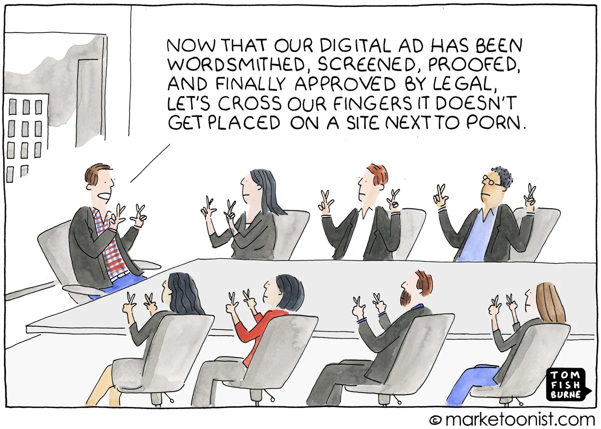{.absolute bottom="20" right="20" height="180px"}

::: {.source-url}
[IAB (2020)](https://www.iab.com/wp-content/uploads/2020/12/IAB_Brand_Safety_and_Suitability_Guide_2020-12.pdf){target="_blank"}
:::

## How much do companies spend on Advertising?

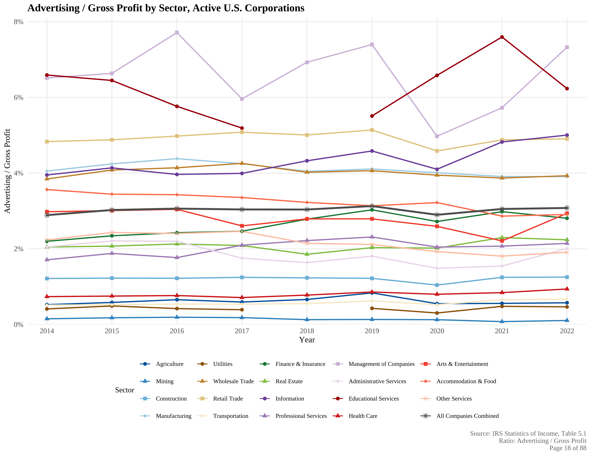{fig-align="center" height="420px"}

::: {.callout-note appearance="minimal" style="font-size: 0.75em;"}
The average US corporation spends about 3.1% of gross margin on advertising deductions. Gross margin ranges from 3-5x net margin, so the modal firm could increase net margin by 10.3-18.5% by setting ads to zero (i.e. 100/(100-9.3) to 100/(100-15.5)). Or could it? What would happen to top line revenue and cost efficiencies? [2 missing data points were withheld by source for confidentiality purposes]
:::

::: {.source-url}
[Wilbur (2026, p. 18)](https://drive.google.com/file/d/1u_62o5PxHqc7deFQQtLoS-gPrAt-TpGy/view?usp=sharing){target="_blank"} | [Saibooks](https://saibooks.com/advertising-sales-ratios/){target="_blank"}
:::

::: notes
-   Also relevant: https://www.rab.com/research/10014.pdf
-   If you care about profit, you should care about advertising
:::

## What is Incrementality?

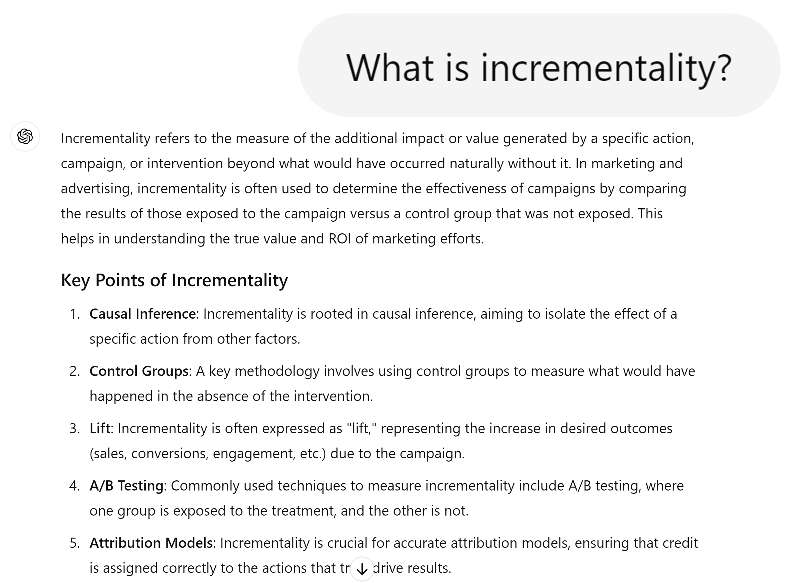{fig-align="center" height="445px"}

::: {.callout-note appearance="minimal"}
Incrementality is the difference between advertising-generated conversions and the conversions that would have occurred anyway without the campaign.

The word incrementality is only used in marketing. However, it is increasingly misused.
:::

# Causality

Examples, fallacies and motivations

::: {.callout-note appearance="minimal"}
"Participants drew causal inferences from non-experimental vignettes as often as they did from experimental vignettes, and more frequently for causal statements and directions of association that fit with intuitive notions than for those that did not."
:::

::: {.source-url}
[Bleske-Rechek et al. (2015)](https://web.archive.org/web/20250826131440/https://www.bleske-rechek.com/April%20Website%20Files/Bleske-Rechek%20et%20al.%202015%20Correlation%20vs%20Causation.pdf){target="_blank"}
:::

## Correlation $\ne$ Causation

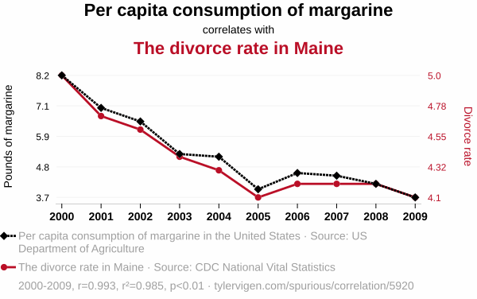{fig-align="center" height="400px"}

::: {.callout-note appearance="minimal"}
This chart shows a near-perfect correlation between margarine consumption and divorce rates—but does margarine cause divorce?
:::

## How Many False Positives? {.medium}

- Suppose you observe 10 customer outcomes, 1,000 predictors, N=100,000 obs
    - Outcomes might include visits, sales, reviews, ...
    - Predictors might include ads, customer attributes & behaviors, device/session attributes, ...
    - Suppose you calculate 10k bivariate correlation coefficients
- Suppose everything is noise, no true relationships
    - 10k correlation coefficients would be distributed Normal, tightly centered around zero
    - A 2-sided test of {corr == 0} would reject at 95% if |r|>.0062
- We should expect 500 false positives - What is a 'false positive' exactly?
- In general, what can we learn from a significant correlation?
    - "These two variables likely move together." Anything more requires assumptions. No causal ordering or reason for co-movement can be inferred from a correlation alone.

::: {.source-url}
[R Script simulating this scenario](https://drive.google.com/file/d/1NuHbXi8QNVkaJQ7QXBWiHqHfvtUaXlCC/view?usp=sharing){target="_blank"}
:::

## Classic misleading correlations {.medium}

- "Lucky socks" and sports wins
    - Post hoc fallacy (precedence indicates causality AKA superstition)
- Commuters carrying umbrellas followed by rain later in the day
    - Forward-looking behavior
- Kids receiving tutoring often get lower grades
    - Reverse causality / selection bias
- Ice cream sales and drowning deaths co-occur
    - Unobserved confounds (hot temperatures drive both)
- Correlations are measurable & usually predictive, but easy to misinterpret
    - Correlation-based beliefs are hard to disprove and therefore persist
    - Correlations that reinforce logical theories especially persist
    - Correlation-based beliefs may or may not reflect causal relationships

::: {.source-url}
[Wikipedia](https://en.wikipedia.org/wiki/Post_hoc_ergo_propter_hoc){target="_blank"}
:::

## "Revenue too high alert"

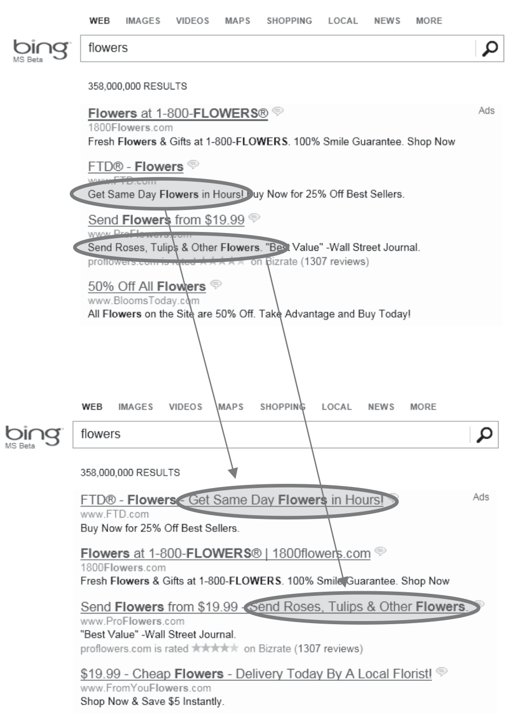{fig-align="center" height="400px"}

::: {.callout-note appearance="minimal"}
This A/B test triggered a "revenue too high" alert at Microsoft Bing in 2012. The treatment improved horizontal space usage and enlarged a selling argument in search ads. It increased revenue 12%—over \$100 million per year—without harming user experience metrics.
:::

::: {.source-url}
[Kohavi & Thomke (2017)](https://hbr.org/2017/09/the-surprising-power-of-online-experiments){target="_blank"}
:::

::: notes
This A/B test triggered a "revenue too high" alert at Microsoft Bing in 2012. The treatment improved horizontal space usage and enlarged a selling argument in search ads. Bing had a robust experimentation platform and culture. They run over 10k tests/year. The RTH alert indicates a possible code error that might be defrauding advertisers. In this case it was just a really big treatment effect, biggest ever.
:::

## Correlation vs Causation

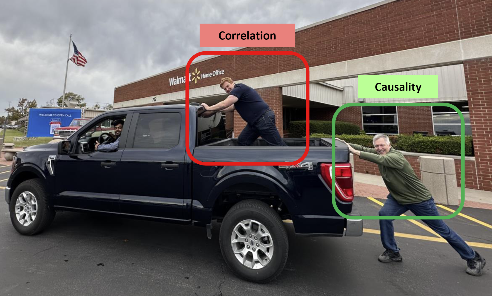{fig-align="center" height="400px"}

::: {.callout-note appearance="minimal"}
The Correlation guy is silly but he's not harmless. He's weighing down the truck. And there is an opportunity cost: he could be helping to push the truck instead.
:::

::: {.source-url}
[List (2023)](https://drive.google.com/file/d/19nrTihLVr0AEaWj3k25ZctyB0h6MLUA8/view?usp=drive_link){target="_blank"}
:::

## Four Types of Analytics

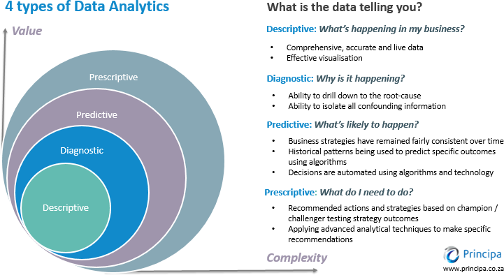{fig-align="center" height="440px"}

::: {.callout-note appearance="minimal"}
Correlations are descriptive analytics ("facts"). Causality matters most for diagnostic and prescriptive analytics. The great power of data analytics is cutting through the noise to isolate the effect of a single variable on outcomes of interest, apart from competing and simultaneous causes. Causality can help build predictive models, but predictive correlations often suffice.
:::

## eBay Search Ad Experiments

In 2015 economists working at eBay published a series of geo experiments testing how shutting off paid search ads affected search clicks, sales and attributed sales in a random sample of US cities.

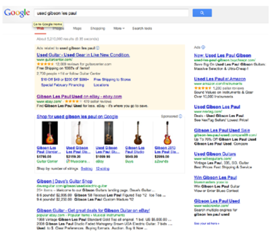{fig-align="center" height="350px"}

::: {.source-url}
[Blake, Nosko & Tadelis (2015)](https://drive.google.com/file/d/1SEQ8YCHFw08Z0zmdQlOoAXIJUlq5Q06q/view?usp=drive_link){target="_blank"}
:::

::: notes
- At the time, eBay was a top-5 Google client, spending over \$1 billion per year on internet ads
- Clicks on paid branded links went to zero, but the effect was entirely replaced with clicks on organic branded links
- Interestingly, the eBay's "attributed sales" did not materially change. That led eBay to fire some of its staff
- There are credible allegations that Google subsequently updated its organic search ranking algorithm to downrank ebay among other commercial sites
:::

## eBay Results: Click Substitution

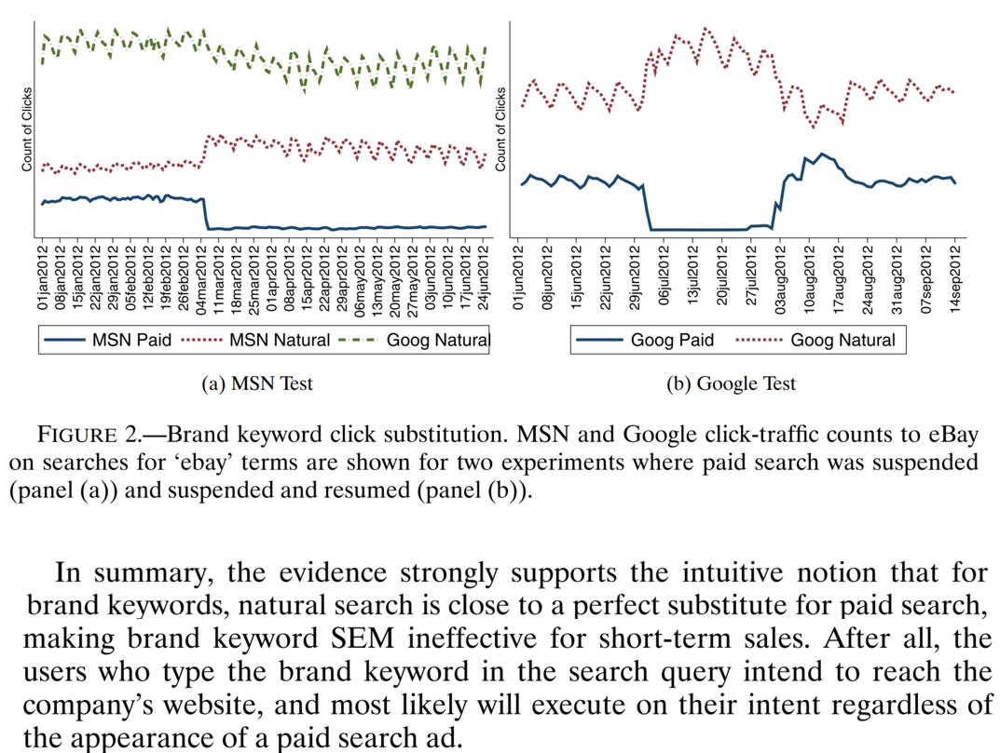{fig-align="center" height="400px"}

::: {.callout-note appearance="minimal"}
When eBay turned off paid search ads, clicks on paid branded keywords went to zero—but clicks on organic branded keywords fully replaced them.
:::

::: {.source-url}
[Blake, Nosko & Tadelis (2015)](https://drive.google.com/file/d/1SEQ8YCHFw08Z0zmdQlOoAXIJUlq5Q06q/view?usp=drive_link){target="_blank"}
:::

## eBay Results: Attribution vs Reality

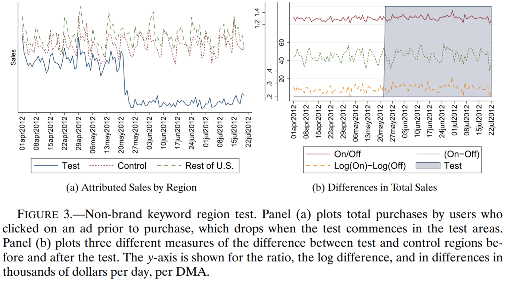{fig-align="center" height="350px"}

::: {.callout-note appearance="minimal"}
Attributed sales fell, but actual sales didn't. (Why?) These results led to changes in eBay ad measurement and Google algorithms. This story became famous for the pitfalls of correlational advertising measurement.
:::

::: {.source-url}
[Fisman (HBR 2013): Did eBay Just Prove That Paid Search Ads Don't Work?](https://hbr.org/2013/03/did-ebay-just-prove-that-paid){target="_blank"} | [Central Control (2025)](https://drive.google.com/file/d/1VY3tIBZhXY9OA4hk8bgUDVsp69XtQwKQ/view?usp=drive_link){target="_blank"}
:::

## Did the eBay result generalize to other companies?

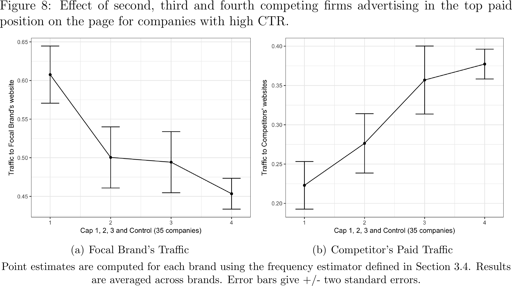{fig-align="center" height="400px"}

::: {.callout-note appearance="minimal"}
A later paper estimated similar effects in Bing search ads. They found that, when competing brands buy ads on a focal firm's branded keywords, sponsored search advertising defends traffic that would not otherwise get to the organic result link. The effects were pretty big. The eBay result did not generalize to companies whose competitors bought their own-branded keyword ads.
:::

::: {.source-url}
[Simonov, Nosko & Rao (2017)](https://drive.google.com/file/d/1K-JyLBizkQuanZPDODVipn3pC9AIzme3/view?usp=drive_link){target="_blank"}
:::

::: notes
- Same Bing experiment methodology, different sample: brands that don't bid on their own keywords
- Key finding: Without defensive advertising, even strong brands lose nearly half their traffic to competitors
- Contrasts with eBay: eBay faced no competitors, so pausing ads cost little. Most brands face competitors who will intercept traffic if given top position.
- With focal brand ad present, competitors in positions 2-4 steal only 1-5% of clicks
- Defensive advertising ROI appears strongly positive when competitors are present
:::

## Did Other Firms Learn from eBay?

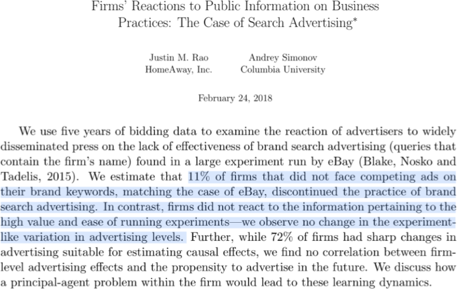{fig-align="center" height="420px"}

::: {.callout-note appearance="minimal"}
A second follow-up study estimated how Bing advertisers changed their advertising policies after the eBay study was publicized. It found that advertisers largely either (a) maintained the status quo, or (b) stopped advertising entirely. However, advertisers did not start running more experiments. (Why not?)
:::

::: {.source-url}
[Simonov & Rao (2018)](https://drive.google.com/file/d/1vvkBNY4D0QSvl1MfXnY4PV2QSZbMLQA6/view?usp=drive_link){target="_blank"}
:::

::: notes
- Authors examined 5 years of bidding data following the eBay study publication
- 72% of firms had enough variation to estimate causal ad effects, but firms didn't use this information
- Principal-agent explanation: marketing teams' incentives may not align with shareholder value maximization
- Suggests organizational barriers to adopting evidence-based advertising measurement
:::

## eBay Case Study: Key Takeaways

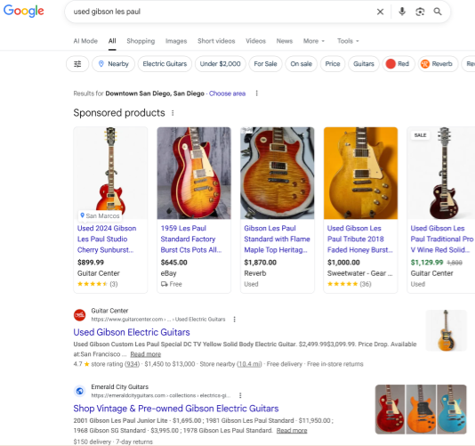{fig-align="center" height="440px"}

::: {.callout-note appearance="minimal"}
eBay taught us that correlational advertising measurement is questionable, and that firms should use experiments to measure causal advertising effects. However, most companies were not ready for that message yet. This 2026 screenshot shows that eBay lost its organic SERP real estate and started buying Google search ads again. That's exactly what it should do when ads are profitable.
:::

::: notes
- This SERP shows a typical competitive landscape: Guitar Center, eBay, Reverb, Sweetwater, and others all bidding on the same guitar search
- eBay's situation was unusual—they faced no competitors on their branded terms
- The lesson isn't "stop advertising" but rather "measure your own causal effects in your own competitive context"
:::

## "Grading Your Own Homework"

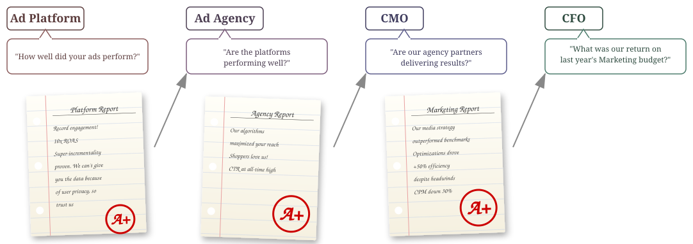{fig-align="center" height="350px"}

::: {.callout-note appearance="minimal"}
Why didn't most advertisers get the right message from eBay? A likely culprit: Textbook principal/agent problems. Today, more marketers have internal agencies, better data, and better capacities to run experiments. It may help if advertising measurement team reports to CFO.
:::

## 2024 Ad Measurement Trends

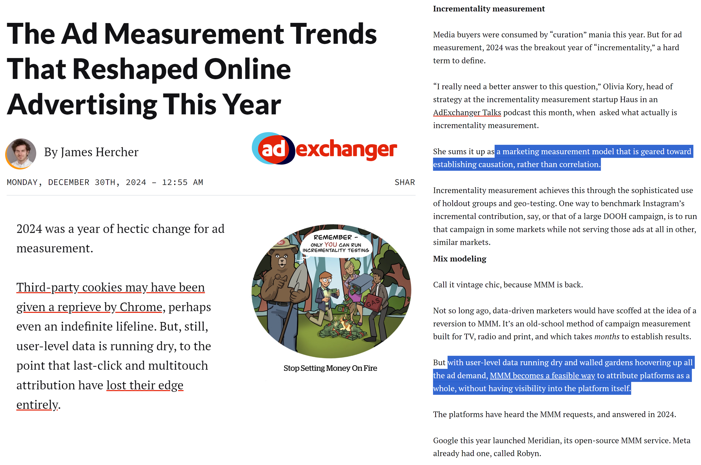{fig-align="center" height="480px"}

::: {.callout-note appearance="minimal"}
Incrementality & MMM were trends #1 & #2; the only other trend was e-commerce metric proliferation.
:::

::: {.source-url}
[AdExchanger (2024)](https://www.adexchanger.com/marketers/the-ad-measurement-trends-that-reshaped-online-advertising-this-year/){target="_blank"}
:::

## Ad Experiments in GTrends and Buy-side Surveys

:::: {.columns}

::: {.column width="45%"}
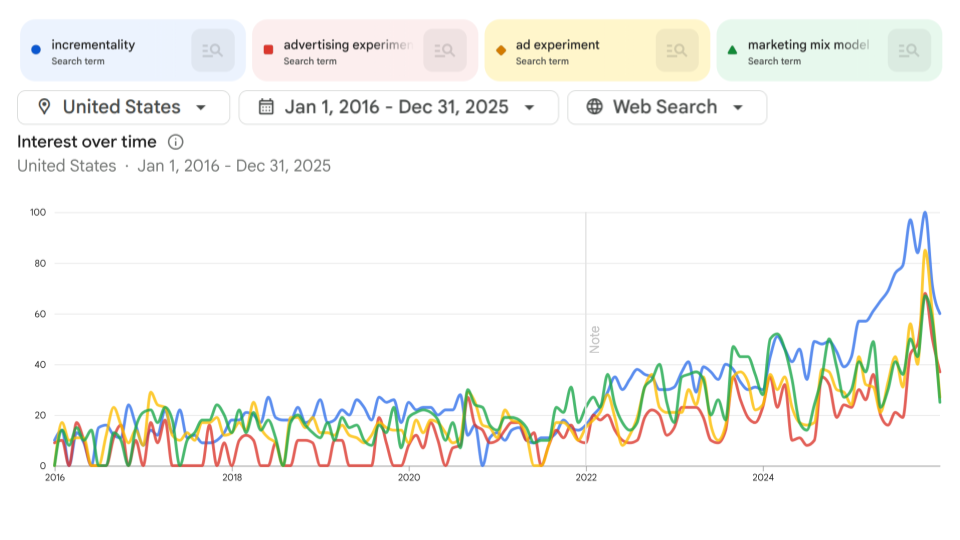{fig-align="center" height="280px"}
:::

::: {.column width="55%"}
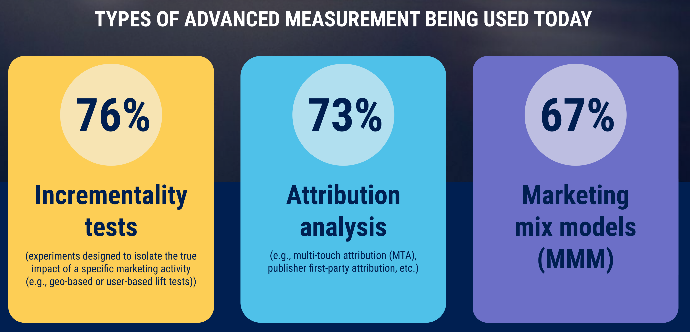{fig-align="center" height="280px"}
:::

::::

::: {.callout-note appearance="minimal"}
We're a few years into a generational shift. Smaller, independent ad agencies are making the most noise about incrementality. However, corr(ad,sales) is not going away. Union(correlations, experiments) should exceed either alone.
:::

::: {.source-url}
[Google Trends](https://trends.google.com/explore?q=incrementality%2Cadvertising%2520experiment%2Cad%2520experiment%2Cmarketing%2520mix%2520model&date=2016-01-01%202025-12-31&geo=US&gprop=web){target="_blank"} | [IAB (2026)](https://drive.google.com/file/d/1nuaUAlV54pDdWyAhd_9I_rFkMi3xeJ2d/view?usp=drive_link){target="_blank"}
:::

# Fundamental Problem of Causal Inference

- Why causal effects are estimable but not directly observable

## Causal Inference Framework {.medium}

- Suppose we have a binary "treatment" or "policy" variable $T_i$ that we can "assign" to person $i$
    - Examples: Send an ad, Serve a webpage, Recommend a product
- Suppose person $i$ could have a binary potential "response" or "outcome" variable $Y_i(T_i)$
    - Marketing funnel examples: Visit site, open app, search products, enter email, add to cart, purchase
    - "Treatment" terminology came from medical literature; Y could be patient outcome
- Important: $Y_i$ may depend fully, partially, or not at all on $T_i$, and the relationship may differ across people
    - Person 1 may buy due to an ad; person 2 may stop buying due to an ad

::: {.source-url}
[Rubin Causal Model](https://en.wikipedia.org/wiki/Rubin_causal_model){target="_blank"}
:::

## Why Care About Causal Effects?

- We want to maximize profits $\Pi = \Sigma_i \pi_i(Y_i(T_i), T_i)$
- Suppose $Y_i=1$ contributes to revenue; then $\frac{\partial \pi_i}{\partial Y_i} >0$
- Suppose $T_i=1$ has a known cost, so $\frac{\partial \pi_i}{\partial T_i} <0$
- Effect of $T_i=1$ on $\pi_i$ is $\frac{d\pi_i}{dT_i}=\frac{\partial \pi_i}{\partial Y_i}\frac{\partial Y_i}{\partial T_i}+\frac{\partial \pi_i}{\partial T_i}$
- We have to know $\frac{\partial Y_i}{\partial T_i}$ to optimize $T_i$ assignments
    - Called the "treatment effect" (TE); can be approximated by $\mbox{\(Y_i(T_i{=}1) - Y_i(T_i{=}0)\)}$
- Profits may decrease if we misallocate $T_i$
    - E.g., buy ads targeting people with inefficiently low response rates

## The Fundamental Problem

- We can only observe **either** $Y_i(T_i=1)$ **or** $Y_i(T_i=0)$, but not both, for each person $i$
    - The case we don't observe is called the "counterfactual"
    - Causality is a missing-data problem that we cannot fully resolve. We only have one reality
        - We can build models to help compensate for missing counterfactuals

::: {.callout-note appearance="minimal"}
The Fundamental Problem of Causal Inference: We cannot directly observe counterfactual outcomes. Therefore, we cannot directly compare $Y_i(T_i=1)$ to $Y_i(T_i=0)$ to measure the treatment effect on person $i$.
:::

## So What Can We Do? {.smaller}

1. **Experiment.** Randomize $T_i$ and estimate $\frac{\partial Y_i}{\partial T_i}$ as avg $Y_i(T_i=1)-Y_i(T_i=0)$
    - Called the "Average Treatment Effect"
    - Creates new data; costs time, money, effort; deceptively difficult to design and then act on
2. **Use assumptions & data** to estimate a "quasi-experimental" average treatment effect using archival data
    - Requires expertise, time, effort; difficult to validate; not always possible
3. **Use correlations:** Assume past treatments were assigned randomly, use past data to estimate $\frac{\partial Y_i}{\partial T_i}$
    - Easier than 1 or 2
    - But $T_i$ is only randomly assigned when we run an experiment, so what exactly are we doing here?
    - Are we paying our DSPs to distribute our ads randomly?
4. **Fuhgeddaboutit,** do not measure
    - Some advertisers do this
    - Measurement is costly; may be a net negative when not possible to do well

::: {.callout-note appearance="minimal"}
Sophisticated companies usually combine 1, 2 and 3
:::

## How Much Does Causality Matter?

- Are organizational incentives aligned with profits?
- Data thickness: How likely can we get a good estimate?
- Organizational analytics culture: Will we act on what we learn? Or are we just trying to get a number to negotiate the budget?
- Individual: Promotion, bonus, reputation, career—Will credit be stolen or blame be shared?
- Accountability: Will ex-post attributions verify findings? Will results threaten or complement rival teams/execs?

::: {.callout-note appearance="minimal"}
Analytics culture starts at the top. The value of causal measurement, and danger of correlational measurement, depends on whether the organization will act on what it learns.
:::

# Advertising Measurement, Defined

- What we measure, challenges, classic eBay measurement case

## Measurement of What?

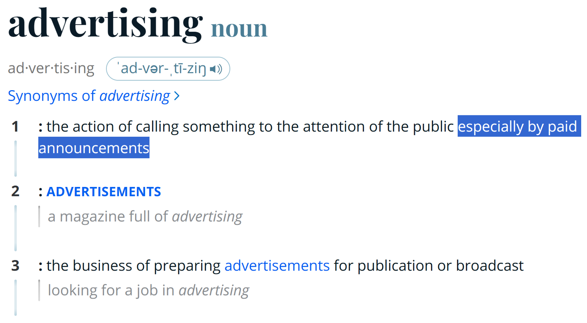{fig-align="center" height="340px"}

::: {.callout-note appearance="minimal"}
Many people use 'advertising' to refer to any commercial speech. In marketing, 'advertising' refers to paid media, as distinct from owned media (e.g., organic social, website, emails, direct mail) & earned media (e.g., reviews, news stories). Paid media implies that a 'publisher' generated the advertising opportunity by attracting consumer attention; sells the ad; and may constrain the advertiser's message, to maintain its own relationship with the consumer.
:::

##

::: {style="text-align: center;"}
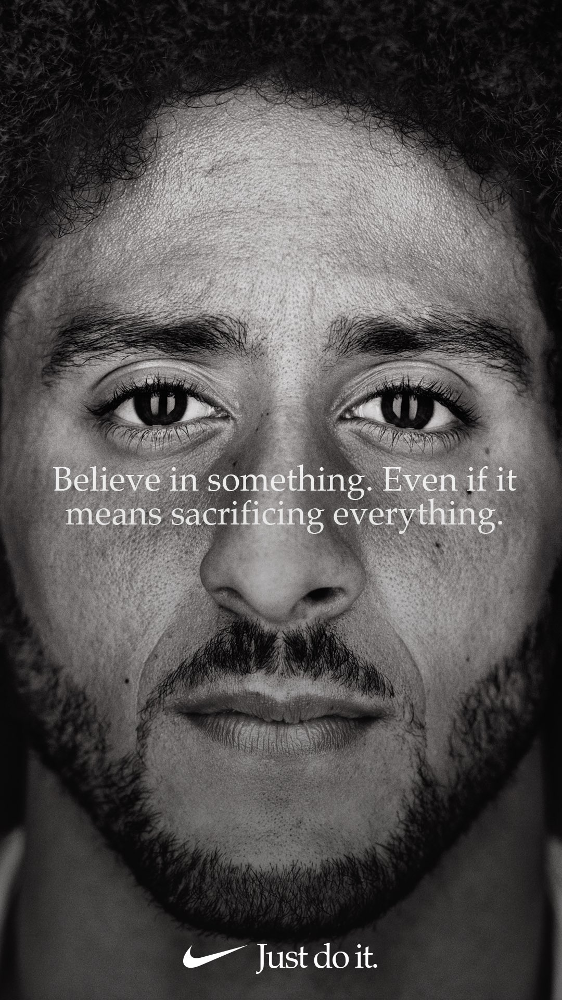{height="400px"} 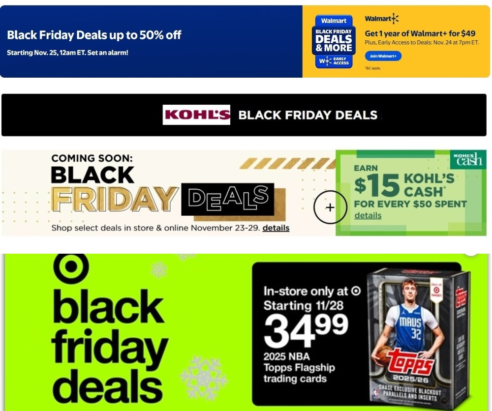{height="400px" style="margin-left: 15px;"}
:::

:::: {.callout-sm style="font-size: 1.05em;"}
::: {.callout-note appearance="minimal"}
- **Brand advertising:** Campaigns designed to generate awareness, create associations, change attitudes and stimulate long-run response. Believed to increase 'mental availability' to increase choice probability in the consumer's next choice occasion. Testable prior to launch
- **Performance advertising:** Campaigns designed to stimulate short-run measurable response, especially visitation and/or sales. Highly amenable to experimentation

::: {style="margin-top: -1.3em;"}
Most large advertisers run both brand and performance campaigns; many believe they work better together. But, brand and performance compete for budget (both internal teams, and external agencies), and sometimes denigrate each other. Some people argue the distinction is artificial, we should test ads on both long-run & short-run metrics.
:::
:::
::::

## Ad Measurement {.medium}

- *Advertising measurement* quantifies ad delivery, exposure and outcomes to improve advertising efforts
    - Our focus here is on outcomes/conversions, as these inform future budget decisions
    - Delivery and exposure matter most for brand ads. Principles include independence and transparency in measurement; these must be checked, cannot be assumed
- Advertising measurement is hard because ad effects depend on ad content, context, timing, targeting, current market conditions, ad prices, past advertising & past outcomes—all of which change
    - Shooting at a moving target
- Advertising measurement is expensive: must *directly* inform future choices

::: {.source-url}
[Bruner (2025)](https://web.archive.org/save/https://www.centralcontrol.com/news-posts/2025/11/12/the-first-principle-of-honest-advertising-measurement-is-independence-from-the-media){target="_blank"}
:::

::: {style="height: 0; margin: 0; overflow: hidden;"}
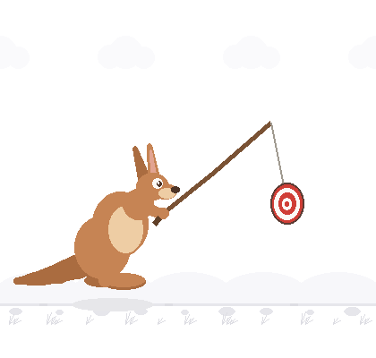{.absolute bottom="20" right="20" height="180px" style="z-index: -1;"}
:::

## What Do We Measure? {.medium}

Often, Return on Advertising Spend (ROAS)

$$\frac{\text{Revenue Attributed to Ads}}{\text{Ad Spending}} \text{ or } \frac{\text{Revenue Attributed to Ads}-\text{Ad Spending}}{\text{Ad Spending}}$$

Increasingly, we report incremental ROAS (iROAS) if we have causal identification, i.e. we isolated causal ad effects

- ROAS ≠ iROAS because attribution is usually correlational

We also should measure delivery and funnel-wide KPIs, e.g. brand metrics, visits, add-to-cart, sales, revenue, ...

- We usually get economies of scope in measurement

::: {.callout-note appearance="minimal"}
Brand Lift Tests measure ad effects on brand attitude surveys, but these are often underpowered. CLV/CAC is increasingly common within subscription businesses
:::

## Diminishing Returns

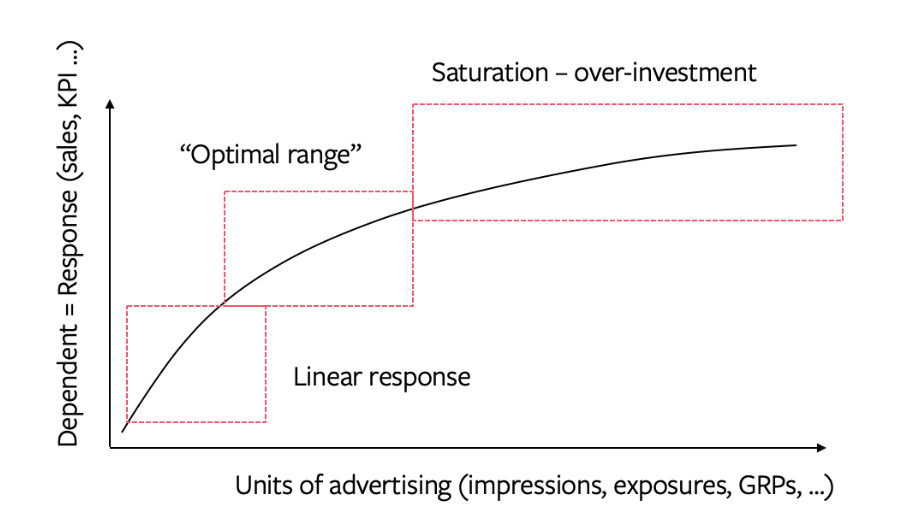{fig-align="center" height="350px"}

::: {.callout-note appearance="minimal"}
In theory, we buy the best ad opportunities first, so increasing spend should lower marginal returns ("saturation"). Marginal ROAS (mROAS) is the tangent to the curve. Nonlinearity means ROAS ≠ mROAS. We use ROAS for overall evaluation, and mROAS for budget reallocation. The common adage to "max your ROI" usually leaves money on the table. (Why?) An optimal budget allocation equalizes mROAS across channels. (Why?)
:::

::: {.source-url}
[Meta (2024)](https://facebookexperimental.github.io/Robyn/docs/features/){target="_blank"} | [Google (2024, pgs. 22-25)](https://sellforte.com/blog/calibrating-marketing-mix-models-with-experiments-and-attribution-data){target="_blank"} | [Galiza (2025)](https://www.021newsletter.com/p/measurement-roas-paid-campaigns-performance-marketing){target="_blank"}
:::

## Albertsons: ROAS Varies with Measurement Choices

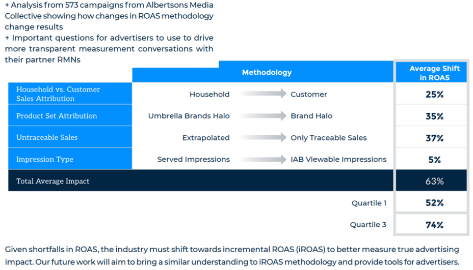{fig-align="center" height="380px"}

::: {.callout-note appearance="minimal"}
Albertsons media group reported a meta-analysis of campaigns showing that correlational ROAS results strongly depend on intermediate measurement choices. In a follow-up study, the same authors stress-tested incrementality (iROAS) measurement and found that methodology choices alone produced 6.5x average variation in iROAS within the same campaign, with 83% of campaigns able to flip sign. What does this imply about hiring black-box vendors vs. doing your own measuring?
:::

::: {.source-url}
[Albertsons Media Group (2025)](https://drive.google.com/file/d/1uyHTykDk3m309orrv5AKKHMzkTDDTYtM/view?usp=drive_link){target="_blank"} | [Ovative & Albertsons Media Collective (2026)](https://s205.q4cdn.com/711494369/files/doc_news/2026/Retail-Media-iROAS-Demystified.pdf){target="_blank"}
:::

# Correlational Advertising Measurement

- Lift statistics, multi-touch attribution, marketing mix models

## Correlational Ad Measurement {.large}

- Correlational advertising measurement is defined by the absence of an identification strategy to isolate causal advertising effects from confounding drivers of sales
    - Equivalently, by the assumption (usually implicit) that past ads were distributed randomly
    - Or, by the belief that we should maximize sales attributed to advertising
- Most common approach historically, but many marketers have adopted incrementality over the past two decades

::: {.callout-note appearance="minimal"}
Corr(ad,sales) is defined by the data, not by the methods, but we will review some of the most common methods used within this paradigm
:::

## 1. Lift Statistics

Compare conversion rates between people exposed to ads and people not exposed to ads

$$\frac{Prob.\{Conv.|Ad\}}{Prob.\{Conv.|NoAd\}} \quad \text{or} \quad \text{\% Lift: } \frac{Prob.\{Conv.|Ad\}-Prob.\{Conv.|NoAd\}}{Prob.\{Conv.|NoAd\}}$$

- E.g., if ad-exposed users convert at 0.6% and non-exposed at 0.4%, Lift Ratio = 1.5, % Lift = 50%

::: {.callout-note appearance="minimal"}
The name 'Lift' implies a causal ad effect, but lift statistics can only be incremental when the data contain a treatment/control analogue. Otherwise lift stats encompass all differences between ad-exposed and non-ad-exposed consumer groups, including ad targeting, context, timing, recent behaviors and platform usage, as well as ad effects. Lift stats are easy to compute and communicate, but often misunderstood as causal.
:::

::: {.source-url}
[Google](https://support.google.com/google-ads/answer/12003020){target="_blank"} | [Meta](https://www.facebookblueprint.com/student/path/253065-conversion-lift-marketing-measurement){target="_blank"}
:::

## 2. Multi-Touch Attribution (MTA) {.medium}

- Get individual-level data on every touchpoint for every purchaser
    - Should include earned media, owned media & paid media (ads, paid influencer & affiliate)
- Choose an attribution rule (First-touch, last-touch, fractional, Shapley)
- MTA algorithm searches for touchpoint parameters that best-predict conversions given the rule
    - Credit then informs future budget allocations across touchpoints
    - MTA assumes touchpoints *solely* drive conversions & disregards nonpurchasers
- Advertiser-side MTA arose from the open web display market, linking tracking cookies to sales. Has challenges integrating walled gardens due to privacy rules and platform reporting limitations. Some advertiser MTAs live on, but some are zombies. Large platform-side MTA will remain viable and efficient, though limited to data within each walled garden; can advertisers trust/verify?

:::: {.callout-sm style="margin-top: -20px;"}
::: {.callout-note appearance="minimal"}
[Amazon Ads](https://drive.google.com/file/d/1n3Jio5ggXfkzw1qCS2lmKJsm6kyPdQxA/view?usp=drive_link){target="_blank"} MTA combines experiments, machine learning and shopping signals.
:::
::::

## 3. Marketing Mix Models (MMM)

- The "marketing mix" consists of the 4 P's. A "marketing mix model" (MMM) typically uses marketing mix variables to explain sales
    - Idea goes back to the 1950s; e.g., suppose we increase price & ads at the same time; what happens to sales?
    - When possible, MMM should include competitor variables also
- A "media mix model" (mMM) relates sales to ads/marcom channels
    - MMM and mMM share many attributes and techniques
- MMM goal is to evaluate past marketing ROAS by channel and inform future budgeting decisions

::: {.source-url style="font-size: 0.65em;"}
Pioneering works: [Magee (1953)](https://pubsonline.informs.org/doi/abs/10.1287/opre.1.2.64){target="_blank"}, [Weinberg (1956)](https://pubsonline.informs.org/doi/10.1287/opre.4.2.152){target="_blank"}, [Vidale & Wolfe (1957)](https://drive.google.com/file/d/1-XUJx5ZdVXL2TW2jT1J56R1_tY9RWk3_/view?usp=drive_link){target="_blank"}, [Little (1972)](https://pubsonline.informs.org/doi/abs/10.1287/opre.23.4.628){target="_blank"}
:::

## MMM Components {.medium}

- We usually estimate MMM with 1-5 years of weekly or monthly data, sometimes across a panel of geographic markets
    - Aggregate data are privacy-compliant & do not usually require platform participation
- Main predictors are ad spend or exposures in each channel, assuming diminishing marginal returns ("saturation") and possibly long-lasting ad effects ("carryover"); outcome is usually sales units, volume or revenue
- MMM often controls for (a) time trends, (b) seasonality, (c) macroeconomic factors, (d) observable demand shifters, (e) competitor marketing
- Outputs include ad elasticities, mROAS measures, counterfactual budget reallocations

::: {.callout-note appearance="minimal"}
In theory, MMM could be highly granular, such as hours and census blocks. However, compromises are required to balance data measurement intervals, refresh rates, accuracy and integrability.
:::

::: {.source-url}
[Johnson et al. (2017)](https://papers.ssrn.com/sol3/papers.cfm?abstract_id=2701578){target="_blank"} meta-analyzed 432 display ad experiments, finding carryover could be positive, zero or even negative
:::

## Using mROAS to Reallocate Spending {.medium}

- MMM fits a sales response curve per channel; mROAS is the slope at current spend, i.e., revenue from the next ad dollar
- ROAS maximization requires harmonizing mROAS across channels
    - Estimation error makes this an uncertain exercise

::: {style="margin: -45px 0 0 0; text-align: center;"}
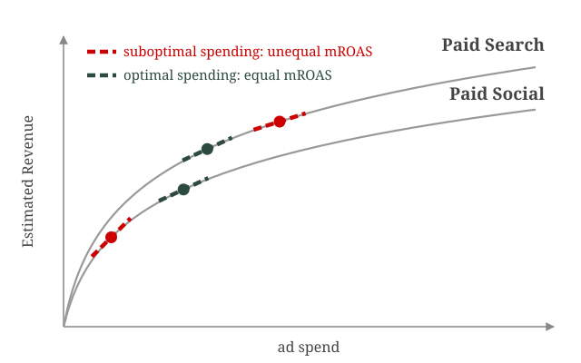{height="340px" style="margin: 0;"}
:::

- Theory says: Max profits by spending until avg. cont. * mROAS = 1 in all channels, but practice is more complicated than that

## MMM Considerations {.tight-li style="font-size: 0.85em;"}

- MMM requires sufficient independent variation in each ad spend predictor, else coefficient estimates will be imprecise due to collinearity
    - Deliberate variation in ad spending, e.g., inversely-correlated pulses across channels, time & geos, helps MMM separate each channel's contribution
- "Model uncertainty": Results can be strongly sensitive to modeling choices, so we usually evaluate multiple models to gauge sensitivity
- MMM results are correlational without experiments or quasi-experimental identification
    - Correlations can be unstable; Bayesian estimation can help regularize
    - MMM results can be calibrated using causal measurements [more later]{style="font-size: 0.6em;"}
- Advertising media can interact, for example when TV ads generate branded search queries due to media multitasking, which then lead to more search ad clicks

::: {.callout-note appearance="minimal"}
Google [Meridian](https://developers.google.com/meridian){target="_blank"} offers Bayesian estimation, hierarchical geo-level modeling, reach & frequency data, experiment-informed ROI priors and a budget-reallocation optimizer. Other open-source frameworks: [BayesianMMM](https://github.com/leopoldavezac/BayesianMMM){target="_blank"}, [mmm_stan](https://github.com/sibylhe/mmm_stan){target="_blank"}, [PyMC-Marketing](https://www.pymc-marketing.io/en/stable/guide/mmm/mmm_intro.html){target="_blank"}, Meta [Robyn](https://facebookexperimental.github.io/Robyn/){target="_blank"}; data generator: [siMMMulator](https://facebookexperimental.github.io/siMMMulator/){target="_blank"}
:::

::: {.source-url}
[Runge & Pauwels (2026)](https://drive.google.com/file/d/14VryMy_JkB3W-DZQOnSH95-ey1YM9EhD/view?usp=drive_link){target="_blank"} | [Arora et al. (2023)](https://github.com/kennethcwilbur/website/raw/master/MSI-MMM-Blue-Ribbon-Panel-Report-Updated.pdf){target="_blank"} | [Joo et al. (2014)](https://drive.google.com/open?id=1kXY7kx7GUNmGvyL07bS5oHpJr8j0OE7r){target="_blank"} | [Du et al. (2019)](https://drive.google.com/open?id=175yrLDY-W15TgBtumPa11WnwMwCeUmSF){target="_blank"}
:::

# How much should we rely on Correlational Ad Measurement?

- Pros & Cons, Research, Explaining Persistence

## Steel-manning Corr(ad,sales) {.tight-li style="font-size: 0.93em;"}

- Corr(ad,sales) should contain signal
    - If ads cause sales, then corr(ad,sales) > 0 (probably) (we assume)
- Some products/channels just don't sell without marketing
    - E.g., Direct response TV ads for 1-800 phone numbers get 0 calls without TV ads, so we know the counterfactual (what is it?)
    - New Shopify stores offering copycat products usually sell nothing without marketing
- However, this argument gets pushed too far
    - For example, when search advertisers disregard organic link clicks when calculating search ad click profits
    - Notice the converse: corr(ad,sales) > 0 does not imply a causal effect of ads on sales; maybe ads got shown to the most loyal customers

::: {.callout-note appearance="minimal"}
Famous books present descriptive evidence about how brands have grown, then extrapolate to prescriptive "laws" about how marketers should act. Parsimonious advice can be appealing and simple, but has been called pseudo-science
:::

## Problem 1 with Corr(ad,sales)

- Advertisers try to optimize ad campaign decisions
    - E.g. ads for surfboards in coastal cities, not landlocked cities
- If ad optimization increases ad response, then corr(ad,sales) will confound actual ad effect with ad optimization effort
    - More ads in San Diego, more surfboard sales in San Diego. But would we have 0 sales in SD without ads? If no, then we need a counterfactual prediction
    - Corr(ad,sales) usually overestimates the causal effect, encourages overadvertising at the expense of profits

::: {.callout-note appearance="minimal"}
Google's Chief Economist [explains](https://drive.google.com/file/d/1VPCvMKQ5d8IKtr1ff-GxR3z1z62YNcEz/view?usp=drive_link){target="_blank"} in greater detail.
:::

## Problem 2 with Corr(ad,sales)

- How do most marketers set ad budgets? Top 2 ways historically:
    1. Percentage of sales method, e.g. 1%, 3% or 6%
        - Ads:sales ratios are often measured for benchmarking
    2. Competitive parity
    3. ...others...
- Do you see the problem here?

::: {.callout-note appearance="minimal"}
This problem is called simultaneity ([Bass 1969](https://drive.google.com/file/d/1CqbQVmEfQ5Aiu_5rtGzY8Mjezqz5Nbtq/view?usp=drive_link){target="_blank"}).
:::

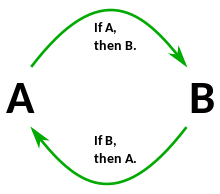{.absolute bottom="20" right="20" height="200px"}

## Problem 3 with Corr(ad,sales)

- Leaves marketers powerless vs ~~big~~ colossal ad platforms
- Platforms withhold data and obfuscate algorithms
    - How many ad placements are incremental?
    - How many ad placements target likely converters?
    - How can advertisers respond to adversarial ad pricing?
- Have ad platforms ever left ad budget unspent?
    - Would you, if you were them?
    - If not, why not? What does that imply about incrementality?
- The only way to balance platforms' pricing power is to know your ad profits & vote with your feet

## U.S. v Google (2024, Search Case)

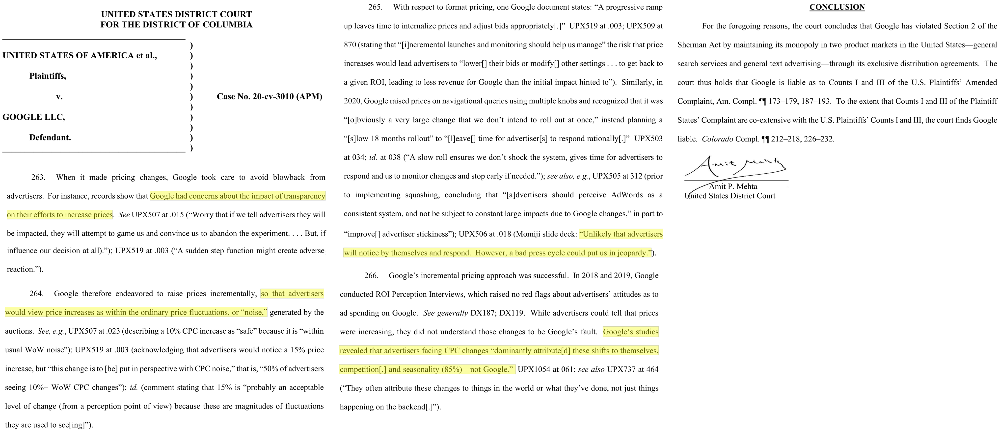{fig-align="center" height="400px"}

::: {.callout-note appearance="minimal"}
This was written by a federal judge who heard mountains of evidence on both sides. Judge Mehta describes Google's efforts to hide price increases from advertisers, based on internal documents.
:::

::: {.source-url}
[U.S. v. Google (2024)](https://drive.google.com/file/d/1QRKYh_dyw1vSkkep3NFQDmEFWPVSHCBd/view?usp=drive_link){target="_blank"}
:::

## Does Corr(ad,sales) Work?

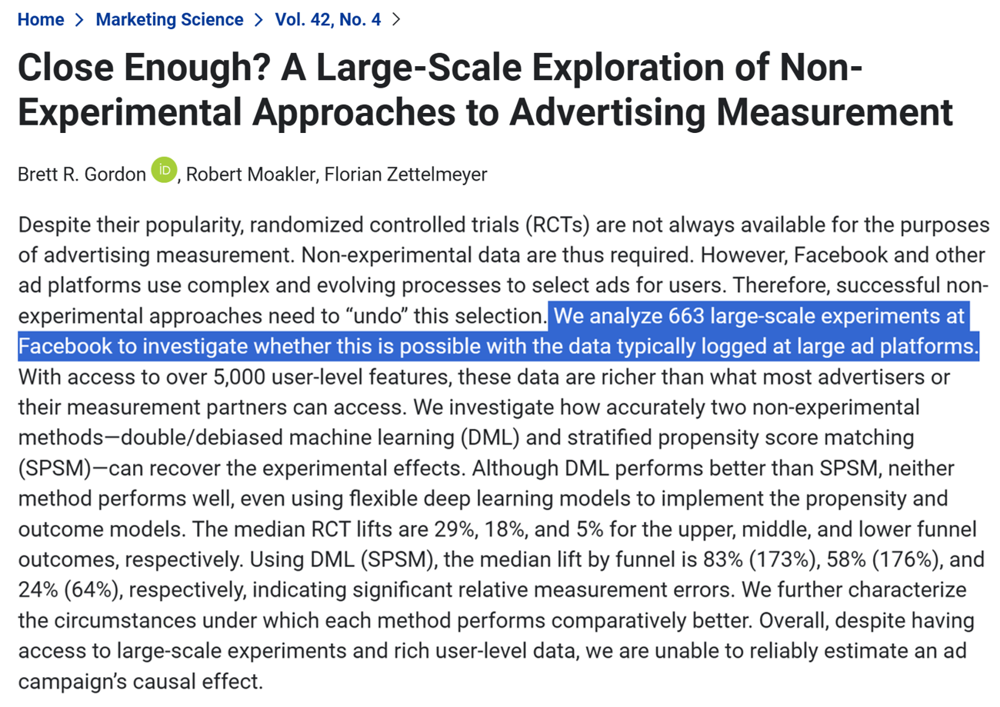{fig-align="center" height="400px"}

::: {.callout-note appearance="minimal"}
Kellogg faculty and Meta data science collaborated to analyze Meta's large trove of advertising experiments. Their main research question: Can we estimate causal advertising effects on sales by applying machine learning models to advertising treatment data alone? I.e., can we recover true causal estimates without non-advertising control condition data?
:::

::: {.source-url}
[Gordon, Moakler & Zettelmeyer (2023)](https://arxiv.org/abs/2201.07055){target="_blank"}
:::

##

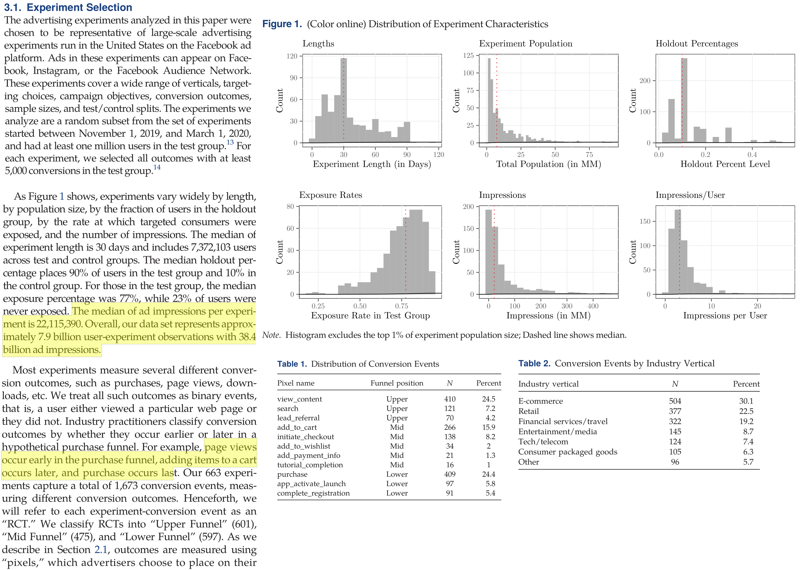{fig-align="center" height="480px"}

::: {.callout-note appearance="minimal"}
The setting was auspicious. Machine learning methods work best when applied to thick data with numerous predictors, as is the case in Facebook data. Additionally, Facebook served most ads from content servers to facilitate consistent measurement and reduce ad-blocking.
:::

::: {.source-url}
[Gordon, Moakler & Zettelmeyer (2023)](https://arxiv.org/abs/2201.07055){target="_blank"}
:::

##

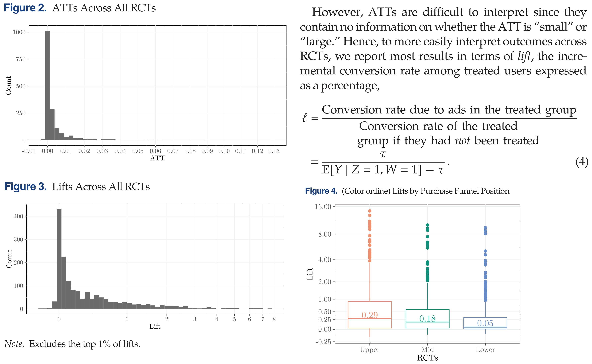{fig-align="center" height="470px"}

::: {.callout-note appearance="minimal"}
Most ad experiments show causal ad effects on conversions of 0-0.25%, with median lift ratios of 0.05-0.29. Ads had clearer effects on upper-funnel actions (e.g., shopping) than on lower-funnel actions (e.g., purchase), as price or other factors can discourage purchases
:::

::: {.source-url}
[Gordon, Moakler & Zettelmeyer (2023)](https://arxiv.org/abs/2201.07055){target="_blank"}
:::

##

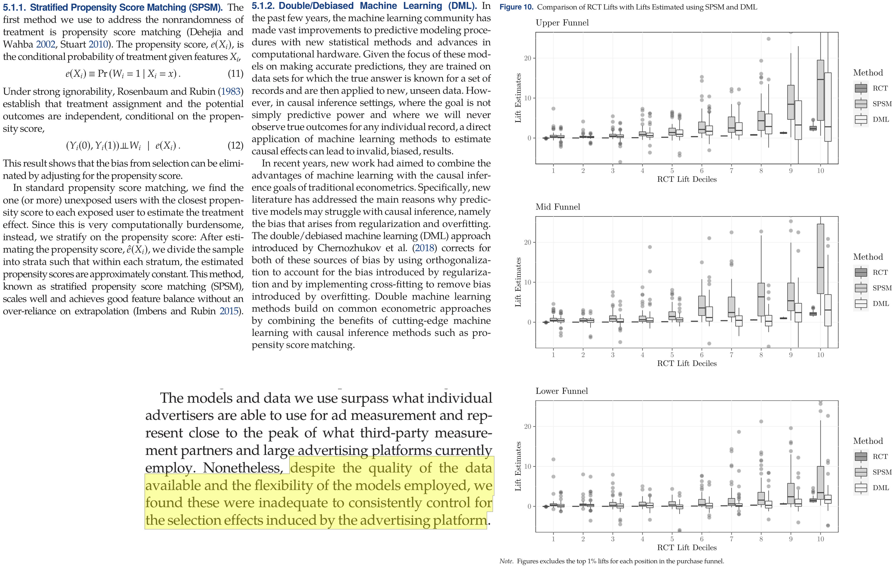{fig-align="center" height="460px"}

::: {.callout-note appearance="minimal"}
Both Machine Learning frameworks tested failed to recover true incremental ad effects. The correlational advertising effects were mostly overestimated, but not always. This offers strong empirical evidence that models alone cannot substitute for causal identification strategies. Causality is a "data problem," not a "modeling problem."
:::

::: {.source-url}
[Gordon, Moakler & Zettelmeyer (2023)](https://arxiv.org/abs/2201.07055){target="_blank"}
:::

## Why Are Some Teams OK with Corr(ad,sales)? {.smaller}

1. Some worry that if ads go to zero → sales go to zero
    - For small firms or new products, without other marketing channels, this may be good logic
    - However, premise implies deeper problems, i.e. need to diversify marketing efforts and find cheaper sources of sales
    - Plus, we can run experiments without setting ads to zero, e.g. test 50% vs. 150%

2. Some firms assume that correlations indicate direction of causal results
    - The guy in the truck bed is pushing forwards right?
    - Biased estimates might lead to unbiased decisions (key word: "might")
    - But direction is only part of the picture; what about effect size?

3. CFO and CMO negotiate ad budget
    - CFO asks for proof that ads work
    - CMO asks ad agencies, platforms & marketing team for proof
    - CMO sends proof to CFO; We all carry on
    - Should ad measurement team report to CFO, CMO, or both?

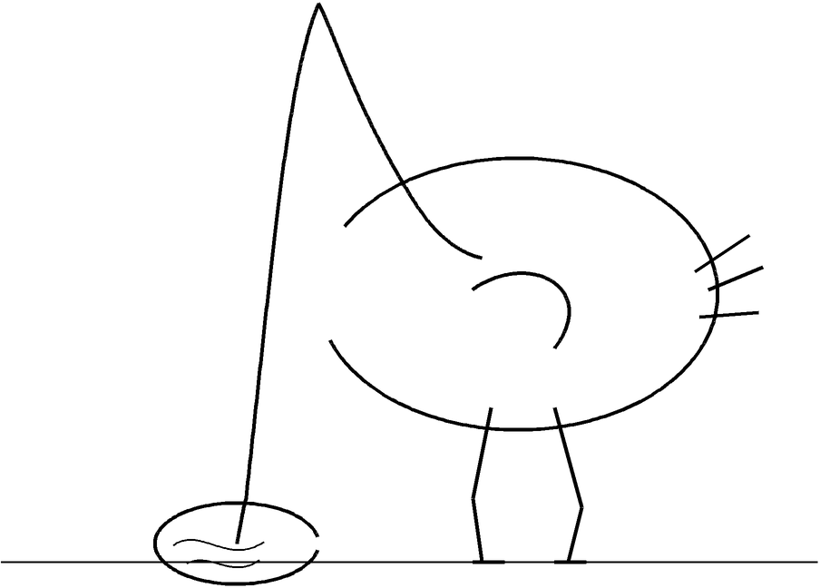{.absolute bottom="20" right="20" height="180px"}

::: notes
That is supposed to be an ostrich sticking its head in the sand, suggesting a willful ignorance. FWIW, the ostrich-head-in-sand fable dates back to the roman empire. In truth, ostriches tend to run away from threats. https://www.scienceworld.ca/stories/do-ostriches-really-bury-their-heads-sand/
:::

## Why Are Some Teams OK with Corr(ad,sales)? {.smaller}

4. Managing analytics well requires skill and discipline
    - Managers must integrate correlational and causal analyses when making decisions
    - Analysts must have causal inference skillsets
    - Organization must tolerate failure in search of data-driven incremental improvements
    - How many shops go back and check their ex-ante predictions? What are the internal incentives for accuracy?

5. Platforms often provide correlational ad/sales estimates
    - Which are larger, correlational or experimental ad effect estimates?
    - Which one might many client marketers prefer?
    - "Nobody ever got fired for buying [___]." [Amazon, Google, Meta]

6. Historically, agencies usually estimated ROAS
    - Agency compensation usually relies on ad spending, not incremental sales; principal/agent problems are common
    - These days, more marketers have in-house agencies, and split work

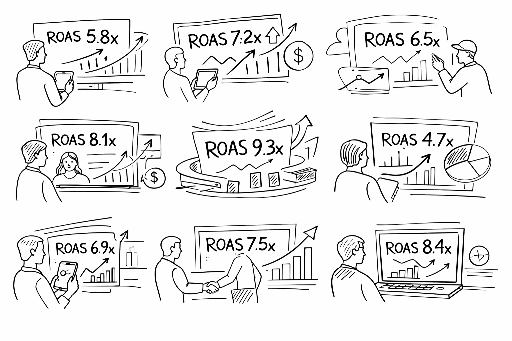{.absolute bottom="0" right="20" height="156px"}

# Causal Advertising Measurement

- Experimental designs, necessary conditions, quasi-experiments

## Causal Ad Measurement

- Causal advertising measurement is defined by the presence of an identification strategy to isolate causal advertising effects from confounding drivers of sales
    - Valid experiments create identification by design
    - We can analyze as-if-random variation, AKA quasi-experiments
    - We often use models to predict credible counterfactuals, but models vary in the plausibility of their identification strategies

::: {.callout-note appearance="minimal"}
In science, *Causal* means we isolate the treatment effect from known confounds *and* from unknown confounds. Often misinterpreted as evidence consistent with a hypothesis, a much lower bar which is prone to motivated reasoning
:::

## Popular ad experiments {.tight-li style="font-size: 0.88em;"}

1. Randomly assign ads eligibility / holdout to customer groups
    - Pros: A/B testing is easy to understand, rules out alternate explanations
    - Cons: Can we trust the platform's "black box"? Will we get the data and all available insights?

2. Randomize messages within a campaign. Mine competitor messages in [ad libraries](https://indicator.media/p/a-guide-to-investigating-digital){target="_blank"} for ideas
    - Often a great place to start as it's nominally free.
    - Advertising professionals frequently believe that creative messages are first-order drivers of ad effects (e.g., [Circana 2023](https://www.circana.com/post/brand-loyalty-impact-on-sales){target="_blank"}, [Kantar 2024](https://www.kantar.com/north-america/inspiration/advertising-media/what-do-the-most-creative-and-effective-digital-and-tv-ads-do-differently){target="_blank"}, [Magna+Yahoo 2025](https://ipg-wp-media-mgl-glb.s3.us-east-2.amazonaws.com/magna/wp-content/uploads/2023/04/27162350/MAGNA-Yahoo-Creative-the-Performance-Powerhouse.pdf){target="_blank"})

3. Geo-Experiment: Randomize budget across geos/time, including "going-dark" designs, "weight tests"

4. Randomize budget across platforms, publishers, times, places, behavioral targets, contexts

::: {.source-url style="font-size: 0.765em;"}
[Recast (2026)](https://research.getrecast.com/geolift-sim-study){target="_blank"} uses simulation to evaluate popular geo-experiment packages, including its own
:::

## Experimental Necessary Conditions {.smaller}

1. Stable Unit Treatment Value Assumption (SUTVA)
    - Treatments do not vary across units within a treatment group
    - One unit's treatment does not change other units' potential outcomes: May be violated when treated units interact on a platform
    - Violations called "interference"; remedies usually start with cluster randomization

2. Observability
    - Non-attrition, i.e. unit outcomes remain observable regardless of outcome

3. Compliance
    - Treatments assigned are treatments received
    - Ad blocking can threaten compliance; we usually resolve by estimating Intent-to-Treat effects

4. Statistical Independence
    - Random assignment of treatments to units. "Balance tests" help to check
    - Ad platforms usually distribute ads nonrandomly, threatening random assignment

::: {.source-url style="font-size: 0.765em;"}
[List (2024)](https://drive.google.com/file/d/1hgI7gi76W7ki27xFeIQkIvtdtULrC7bb/view?usp=drive_link){target="_blank"}; [Kohavi et al. (2020)](https://experimentguide.com/){target="_blank"}
:::

## Before You Kick Off Your Test... {.tight-li style="font-size: 0.85em;"}

- Run A/A test before your first A/B test. Validate the infrastructure before you rely on the result
    - Shows the effect size a given test duration is powered to detect
    - Shows whether random assignment is working, as it's sometimes coded incorrectly; [Kelly (2025)](https://drive.google.com/file/d/1D-lL_3h4Cue4bO0_O3EYrtzCKwzSsGl9/view?usp=drive_link){target="_blank"} explains how randomization is easy to mess up, e.g. assignment based on nonrandom factors (user IDs, time) and pseudorandom generator misuse
- Can we agree on the opportunity cost of the experiment? "Priors"
    - Confident execs argue control-condition exposures reduce profits due to foregone advertisements; [Feit and Berman (2019)](https://arxiv.org/abs/1811.00457){target="_blank"} discuss how to choose sample size to maximize profit, reframing from inferential validity to minimizing statistical regret, and dramatically reducing test size in many cases
- How will we act on the (uncertain) findings? Have to decide before we design. We don't want "science fair projects"
    - Simple example: Suppose we estimate iROAS at 1.5 with c.i. [1.45, 1.55]. Or, suppose we estimate iROAS at 1.5 with c.i. [-1.1, 4.1]. What actions would follow each?

## Platform Experiments Advisory {.medium}

- Meta offers two experimentation frameworks:
    - Lift tests randomize users to ad eligibility against a no-ad holdout--a valid intent-to-treat estimate of ads eligibility
    - A/B tests randomize users across campaign configurations with no holdout. The issue is that an ad delivery algo sits between configuration and delivery, so the configurations effectively "treat" the delivery algorithm and violate the user compliance assumption--a confound called "divergent delivery"
- Some platforms require advertisers meet minimum spend levels to use on-platform experimentation tools. You can roll your own experiments by randomizing ad budget across time and targeting criteria
- [Ghost ads](https://drive.google.com/file/d/1V9_YHaeiwZkIp4zE3bHhvfRfa-4KrOmT/view?usp=drive_link){target="_blank"} is an ingenious system to randomly withhold ads from auctions and maximize experiment efficiency

::: {.source-url}
[Haus (2025)](https://www.haus.io/blog/what-youre-actually-measuring-in-a-platform-a-b-test){target="_blank"} | [Braun & Schwartz (2025)](https://drive.google.com/file/d/11BhiE3wJqaKQ9S73Mjt1hbZJRhkvZvv5/view?usp=drive_link){target="_blank"} | [Burtch et al. (2025)](https://drive.google.com/file/d/1PMahIPaXUzg4Ji1ankuUhZ8Ra-7qW8zp/view?usp=drive_link){target="_blank"}
:::

## Display Ad Experiments can be Tricky {.medium}

- Noisy environments: Data feature agentic consumers & publishers, media content, competitor ads, shifting algorithms and marketing conditions; interactions abound
    - Similar to how we have limited causal knowledge about nutrition and human welfare
- Compliance: Ad blocking, ad avoidance, non-visibility and non-delivery can all prevent treatment
- Identity fragmentation: User may be treated on mobile, then convert on nontreated device or nontreated channel (e.g., retail store)
- Platforms optimize for total conversions, not incremental conversions
- Transportability: Valid in-context experiments may not generalize when context changes

::: {.callout-note appearance="minimal"}
Johnson's guide reviews best practices for experimenters working at the frontier of digital advertising experiments.
:::

::: {.source-url style="font-size: 0.765em;"}
[Johnson (2023)](https://papers.ssrn.com/sol3/papers.cfm?abstract_id=3581396){target="_blank"}
:::

## Productive Experiments... {.medium}

- Serve customer interests
    - Working against customers drives customers away
- Live within theoretical frameworks
    - We require hypotheses if we want to learn from tests
- Test quantifiable hypotheses
    - Choose test size & statistical power based on hypothesis
- Analyze all relevant customer metrics
    - Test positive & negative metrics, e.g. conversions & bounce rates
    - Test short-run & long-run metrics, e.g. trial & repurchase
- Acknowledge possible interactions between variables
    - E.g. price advertising effects will always depend on the price

::: {.source-url style="font-size: 0.765em;"}
[Zumsteg (2022), Unchecked AB Testing Destroys Everything It Touches](https://drive.google.com/file/d/1fcY6tdB01Dlr5UXLNFXyjCRJyvHOxXs5/view?usp=sharing){target="_blank"}
:::

## Quasi-experiments Vocabulary {.smaller}

- Model: Mathematical relationship between variables that simplifies reality, e.g. y = xβ + ε
    - May be estimated using either experimental data, non-experimental data, or combination
- Identification strategy: Set of assumptions that isolate a causal effect $\frac{\partial Y_i}{\partial T_i}$ from other factors that may influence $Y_i$
    - Compare apples with apples, not apples with oranges
    - May be baked into a model, or may stand alone, e.g. A/B test comparison of means
- Popular quasi-experimental techniques: Difference-in-differences, regression discontinuity, instrumental variables, synthetic control, matching. Each technique predicts what counterfactual would have occurred without treatment
- We "identify" the causal effect when our identification strategy reliably distinguishes $\frac{\partial Y_i}{\partial T_i}$ from possibly correlated unobserved factors
- If you estimate a model without a valid identification strategy, results are correlational AKA descriptive
    - Common misconception: Identification is a property of a model. Correction: It's a logic of comparison, whether embedded within a model or not

::: {.callout-note appearance="minimal"}
[Sant'Anna (2026)](https://psantanna.com/did-resources/){target="_blank"} discusses difference-in-differences theory and code.
:::

## Diff-in-Diffs Helped Identify Cholera Cause {.smaller .callout-tight}

In the 1850s, an English doctor named John Snow suspected that cholera spread via food and drink, rather than the popular theory of airborne transmission. Snow realized a natural experiment offered identification.

::: {.callout-note appearance="minimal"}
Some London neighborhoods were served by multiple water companies. One company, Lambeth, moved its intake pipes higher up the Thames to obtain cleaner water, whereas its competitor Southwark and Vauxhall (S&V) kept its downstream intake.

Snow went door to door to count customers who subscribed to each water company. He also matched those households' records against the city's mortality records to calculate cholera death rates by water company over time. In 1849, death rates were 85 per 100k Lambeth customers and 135 per 100k S&V customers. In 1854, after the water intake change, death rates were 19 per 100k Lambeth customers, and 147 per 100k S&V customers.

Assuming household cholera risk factors were unrelated to water company choice, then the change in S&V death rates estimated the counterfactual change for Lambeth, showing that cleaner water meaningfully reduced cholera deaths. This discovery came before the germ theory of disease (1860s) and modern experimental methods. (What are the two diffs?)

This exemplifies an identification strategy without a complicated mathematical model
:::

::: {.source-url style="font-size: 0.765em;"}
[Cunningham (2026)](https://web.archive.org/web/20260118042754/https://mixtape.scunning.com/09-difference_in_differences){target="_blank"}
:::

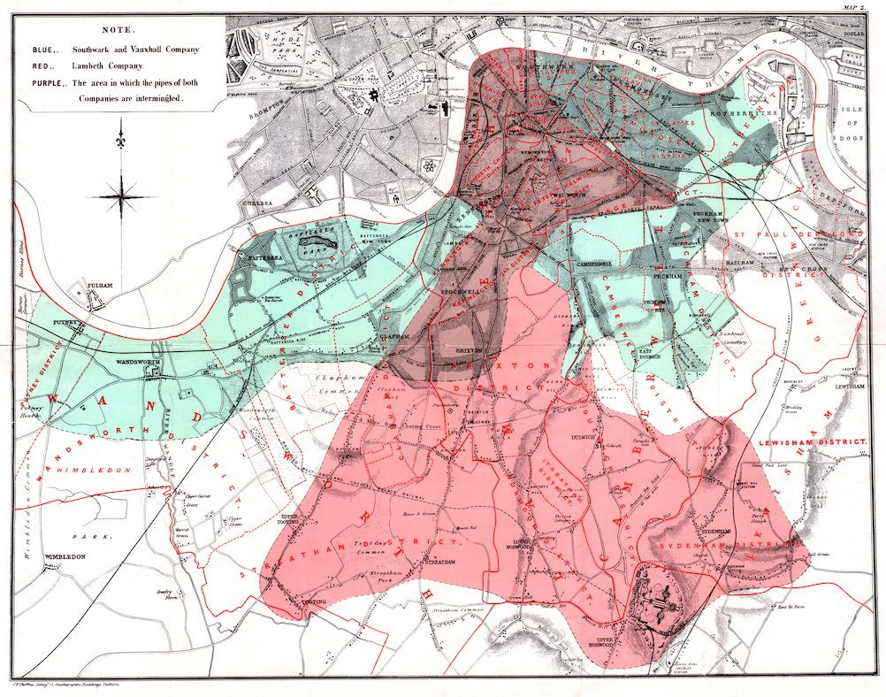{.absolute bottom="20" right="20" height="180px"}

::: notes
The map shows the overlapping territories of the two water companies within London.
:::

## Ad/Sales: Quasi-experiments

Goal: Find a "natural experiment" in which $T_i$ is "as if" randomly assigned, to identify $\frac{\partial Y_i}{\partial T_i}$

Possibilities:

- Firm starts, stops or pulses advertising without changing other variables
- Competitor starts, stops or pulses advertising
- Discontinuous changes in ad copy
- Exogenous changes in ad prices, availability or targeting (e.g., elections increase ad prices)
- Exogenous changes in addressable market, web traffic or other factors

## TV Ad Effects on Google Search

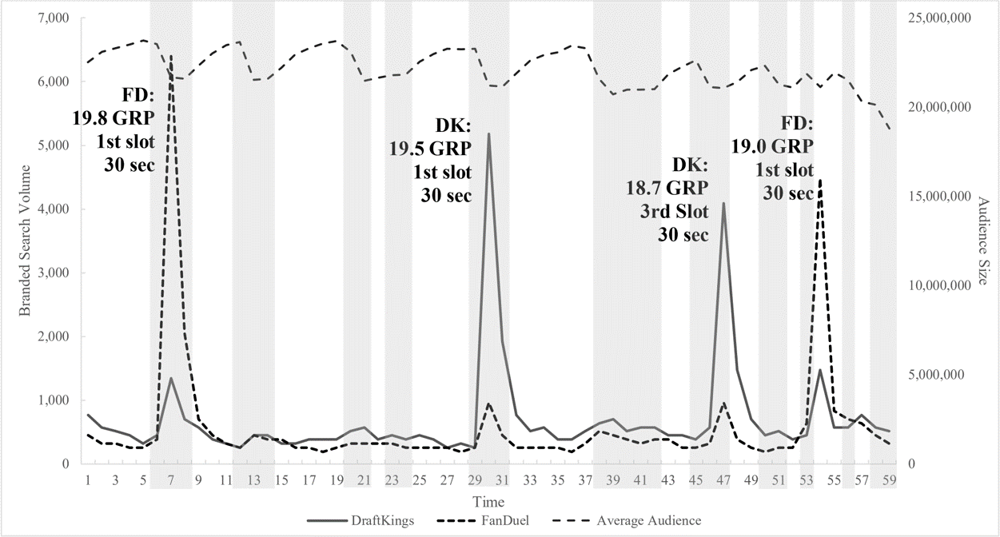{fig-align="center" height="440px"}

::: {.callout-note appearance="minimal"}
I made this graph showing DraftKings and FanDuel branded keyword search volume from 9:01-9:59pm ET during the 2015 NFL season opener. TV ads increased search volume by 15-25x, with positive competitive spillovers, and effects that returned to baseline within 5 minutes. Commercial minutes are shaded, showing the spikes came from ads, not just commercial breaks.
:::

::: {.source-url}
[Du et al. (2019)](https://drive.google.com/file/d/175yrLDY-W15TgBtumPa11WnwMwCeUmSF/view){target="_blank"}
:::

## Ad/Sales: Quasi-experiments (2) {.smaller}

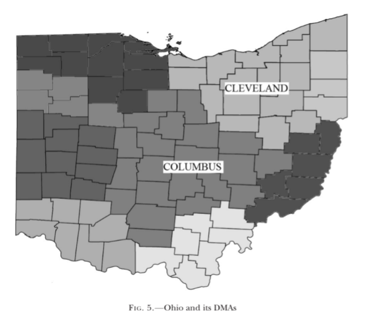{fig-align="center" height="300px"}

::: {.callout-note appearance="minimal"}
[Shapiro et al. (2021)](https://drive.google.com/file/d/1f3JLTvIsltKej0DDae_vkZyAOmBXI13Y/view?usp=drive_link){target="_blank"} used a county-border approach to identify how local TV advertising affected packaged goods sales. Media market boundaries reflect broadcast signal footprints, not consumer markets, so consumers on either side of a geographic market boundary are very similar. Therefore, border-county sales predict what in-market sales would have been without advertising.
:::

::: {.source-url style="font-size: 0.765em;"}
See also [Shapiro (2018)](https://drive.google.com/file/d/1iIKeBlhpJhjGDq_UE8AVKAmpQPsalqvq/view?usp=drive_link){target="_blank"}
:::

## Experiments vs. Quasi-Experiments

- Experimentalists and quasi-experimentalists differ in beliefs, cultures & training, not unlike Bayesians vs. Frequentists
    - Like B&F, E & Q-E are more similar than different, which is why the debates can get fierce
- Generally speaking, quasi-experiments:
    - Always depend on untestable assumptions (as do experiments)
    - Are bigger, faster & cheaper than experiments when valid
    - Will lead us astray when not valid
    - Are easy to apply even when invalid
    - Range from challenging-to-validate to impossible-to-validate
- Experiments & quasi-experiments should be "yes-and-when-valid," not "either-or"

# Who experiments and why?

- Which companies bother with causality? Does it impact results?

## Who Tests the Most?

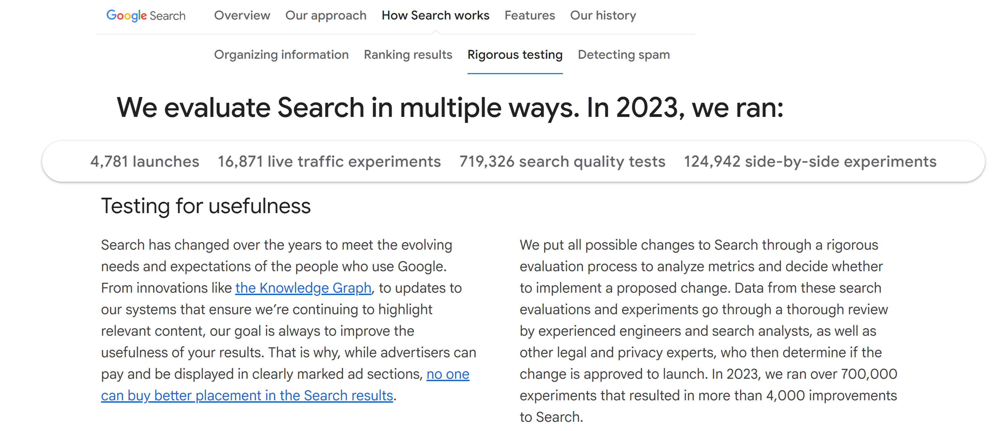{fig-align="center" height="440px"}

::: {.source-url}
[Google](https://www.google.com/intl/en_us/search/howsearchworks/how-search-works/rigorous-testing/){target="_blank"}
:::

## CEO Quotes on Experimentation {.smaller}

"To invent you have to experiment, and if you know in advance that it's going to work, it's not an experiment." —Bezos, Amazon

"In a culture that prioritizes curiosity over innate brilliance, 'the learn-it-all does better than the know-it-all.'" —Nadella, Microsoft

"We ship imperfect products but we have a very tight feedback loop and we learn and we get better." —Altman, OpenAI

"You do a lot of experimentation, an A/B test to figure out what you want to do." —Chesky, Airbnb

"The only way to get there is through super, super aggressive experimentation." —Khosrowshahi, Uber

"Create an A/B testing infrastructure." —Huffman, on his top priority as Reddit CEO

## Advertising Experiment Frequency

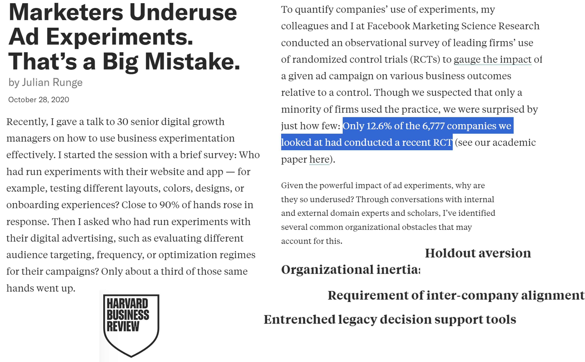{fig-align="center" height="480px"}

::: {.callout-note appearance="minimal"}
These four obstacles are all management challenges.
:::

::: {.source-url}
[Runge (2020)](https://hbr.org/2020/10/marketers-underuse-ad-experiments-thats-a-big-mistake){target="_blank"} | [Runge et al. (2020)](https://drive.google.com/file/d/1Xetwnrv6dLyhXKlTK0vYaZ5yEnB6K8iY/view?usp=sharing){target="_blank"}
:::

## Advertising Experiment Effectiveness

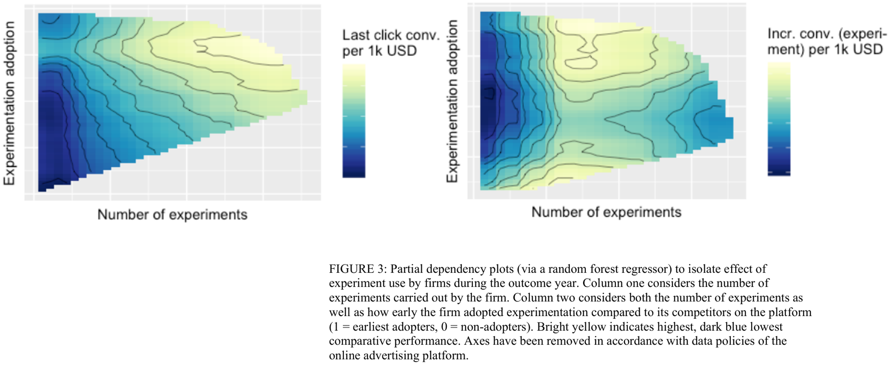{fig-align="center" height="400px"}

::: {.callout-note appearance="minimal"}
Companies with deep experimental practices tend to get much better results per ad dollar spent. Ironically, results are correlational; experimentation is not randomly assigned.
:::

::: {.source-url}
[Runge et al. (2020)](https://drive.google.com/file/d/1Xetwnrv6dLyhXKlTK0vYaZ5yEnB6K8iY/view?usp=sharing){target="_blank"}
:::

# Integrating Methods

- Ways to best combine correlational and causal ad measurement

## {.tight-media}

::: {style="display: flex; justify-content: center; align-items: center; gap: 16px;"}
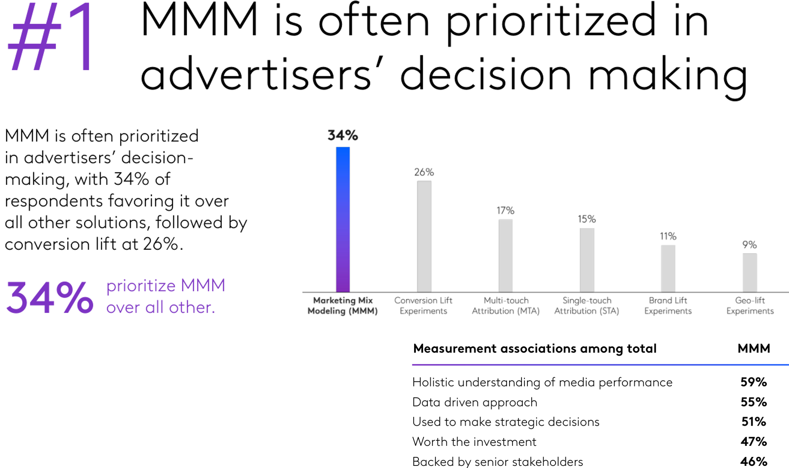{height="270px"}

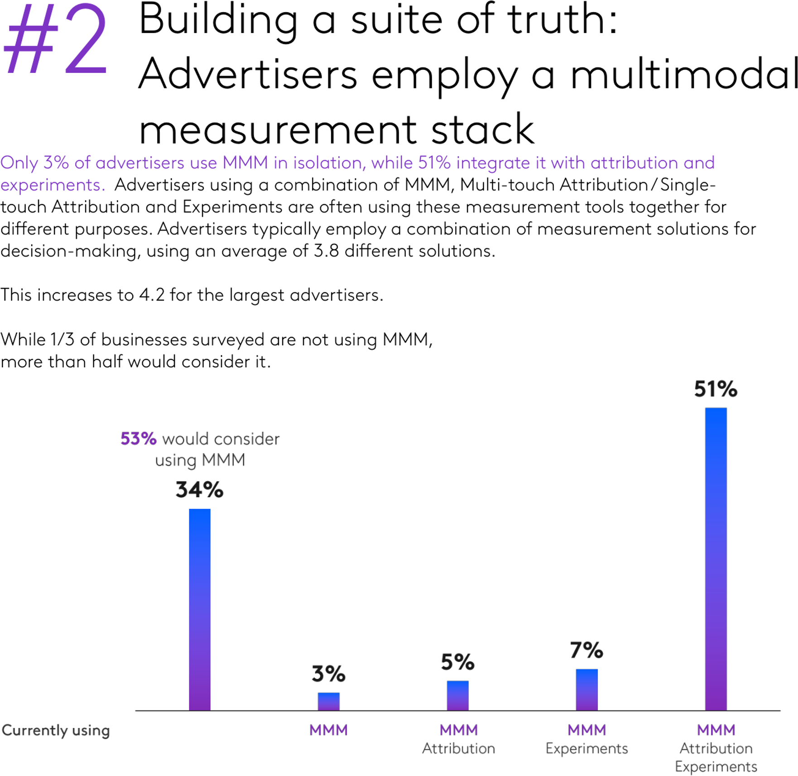{height="288px"}
:::

::: {style="display: flex; justify-content: center; align-items: center; gap: 16px; margin-top: 8px; margin-left: 120px;"}
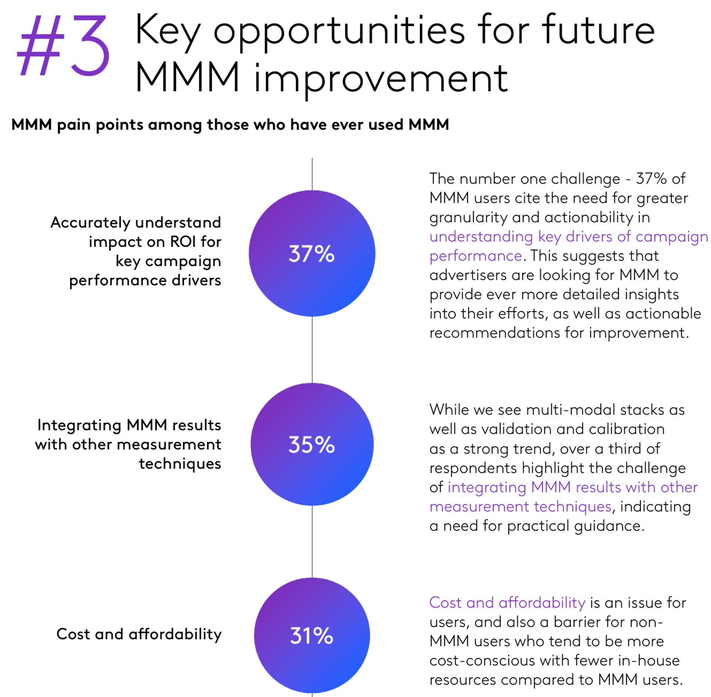{height="268px"}

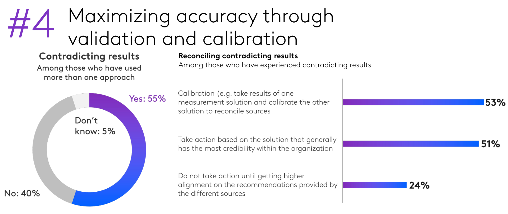{height="265px"}
:::

::: {.callout-note appearance="minimal"}
[Kantar (2025)](https://drive.google.com/file/d/1AsafqvDMIJe1BvQ7hBXB1iQiFa4uNJ5N/view?usp=sharing){target="_blank"} surveyed 1,935 decision makers across regions, industries and company sizes investing over $1MM in digital advertising
:::

## Integrating MMM with Causal Measurement

- Correlational methods are cheap & always-on; Experiments are credible but scarce & costly; Both are noisy; Measures will disagree

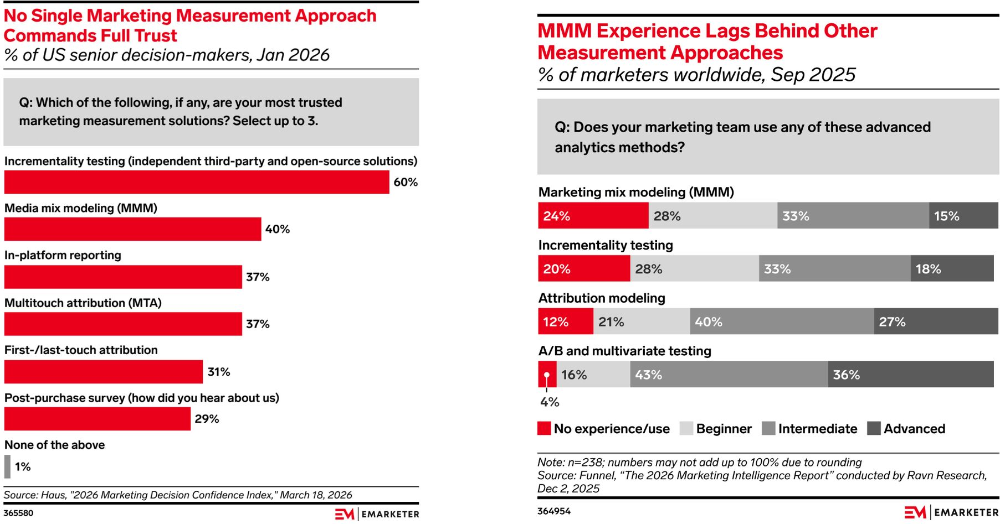{fig-align="center" height="375px"}

::: {.callout-note appearance="minimal"}
Management challenge: What do we do when Attribution says ROAS was 5.9, MMM says ROAS was 2.3 +/- 1.2 and Experiment says ROAS was 0.6 +/- 2.1?
:::

## Using Experiments to Validate MMM Reallocations

- A natural first step is to validate correlational ad measurement with experiments
- Dropbox did this with small experiments in Canada, then a month-long full-US blackout on mobile and search, which showed that search attribution was 117% too high
- Mobile-trial starts fell 5%, but earnings guidance increased, citing performance marketing efficiency as a key driver
- More generally, when MMM recommends a change, run a test alongside implementing the change, and compare the resulting test result to the MMM prediction c.i.
    - This tests MMM output's predictive validity

{.absolute bottom=25 right=30 height="55px"}

::: {.source-url}
[Chivukula et al. (2026)](https://drive.google.com/file/d/1oQdt1R7gVPUuKKdgz3eDDpujjvGPLf1S/view){target="_blank"}
:::

## Using Experiments to Calibrate MMM {.medium}

- Use causal ad measurements to constrain & improve MMM
    - Priors: experiment results set Bayesian channel-ROI priors ([Meridian docs](https://developers.google.com/meridian/docs/advanced-modeling/roi-priors-and-calibration){target="_blank"}; [Google Research 2024](https://research.google/pubs/media-mix-model-calibration-with-bayesian-priors/){target="_blank"}). [Kaminsky (2025)](https://getrecast.com/how-to-use-lift-tests-to-calibrate-an-mmm/){target="_blank"} advises to apply experiment's full confidence interval, but only to MMM observations in which the experiment ran
    - Model Selection: [Robyn](https://facebookexperimental.github.io/Robyn/docs/features/){target="_blank"} scores candidate models on ability to reproduce incrementality estimates, alongside business and statistical criteria ([Runge et al. 2024](https://arxiv.org/abs/2403.14674){target="_blank"})
    - Experiments can enter the likelihood as observations, grounding each channel's response curve using the experimental result ([PyMC-Marketing](https://www.pymc-marketing.io/en/latest/notebooks/mmm/mmm_lift_test.html){target="_blank"})

::: {.callout-note appearance="minimal"}
Prior-based and likelihood-based calibration deliver similar accuracy improvements ([Orduz 2024](https://www.pymc-labs.com/blog-posts/mmm_roas_lift){target="_blank"})
:::

::: {.source-url}
[See also Recast](https://docs.getrecast.com/docs/experiments){target="_blank"}
:::

## Unified Marketing Measurement {.medium}

- Management considers MMM, Experiments, Attributions, and Brand Lift Tests holistically, seeking to understand the relationships between them, and pros and cons of each, rather than giving primacy to any single measure in all situations ([Andrew 2024](https://ipa.co.uk/knowledge/ipa-blog/making-measurement-triangulation-work){target="_blank"}, [Maheswaran 2026](https://lifesight.io/blog/unified-marketing-measurement-guide/){target="_blank"})
- When measures overlap, we can compare them directly, to estimate the bias of the less-credible measure. E.g., if an experiment result is half as large as a comparable attribution, then similar attributions might be deflated by 50%. The stability of intermeasure comparisons then becomes important
- [Gordon, Moakler & Zettelmeyer (2026)](https://arxiv.org/abs/2304.06828){target="_blank"} propose Predicted Incrementality by Experimentation (PIE) in which past campaigns with experiments are used to create a mapping from campaign features to ad effect estimates, then untested campaigns are scored based on the mapping. The model performs well out of sample, suggesting that mappings between experiments and other measurements can be stable

::: {.callout-note appearance="minimal"}
Challenges remain when mappings prove unstable or when insufficient past experiments exist
:::

## Iteration {.medium}

- Use MMM estimates to identify high-value experiments to invest in; which experiments would maximally inform our next MMM?
- Induce some randomness in ad spend by Channel/Time/Geo so that MMM can estimate causal parameters
    - Switchback design could be used to iterate between heavy and light spending levels
    - A fixed proportion of MMM observations could be reserved for random deviations from optimal spending
    - Approaches like these may require platform APIs to set campaign budgets at granular levels. Sophisticated buying requires expertise

::: {.callout-note appearance="minimal"}
All three integration approaches can be used simultaneously
:::

## Incrementality $\ne$ Optimality

- Incrementality asks whether the ads truly worked; optimality asks whether the ads maximized profit
    - A profitable channel may be overfunded or underfunded
- Experiments can inform profit maximization by measuring the profitability of acquired customers, not just their number
    - We can correlate customer margin, development, retention/churn, and CLV with changes in ad budgets by channel
    - We can compare customer margin, development, retention/churn and CLV between experimental treatment and control cells

::: {.callout-note appearance="minimal"}
There has been limited public discussion about optimality to date. It should be the next frontier after incrementality is better established and managed
:::

## What would you do? {.smaller}

::: {style="margin: 0; line-height: 1; text-align: center;"}
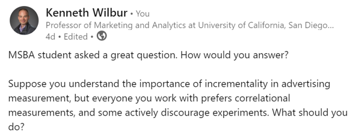{height="150px" style="margin-bottom: 0;"}
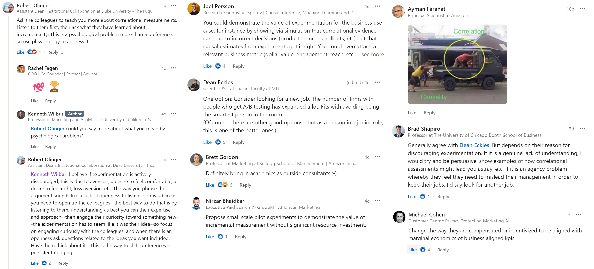{height="300px" style="margin-top: 0; margin-bottom: 0;"}
:::

::: {.callout-note appearance="minimal"}
Leading a traditional team to adopt incrementality can be a resume headline and interesting challenge, especially if you apply it to solve your hardest challenge. However, it requires leadership support, you usually cannot do it alone. If structural incentives misalign, consider a new role.
:::

# Wrapping Up

- Takeaways, Resources for further study, Acknowledgements

## Takeaways

- Fundamental Problem of Causal Inference: We can't observe all data needed to optimize actions. This is a missing-data problem, not a modeling problem.
    - Common remedies: Experiments, Quasi-experiments, Correlations, Triangulate; Ignore

- Incrementality-based advertising measurement is a generational shift improving marketing profits, but we still have a long way to go

- Experiments are the gold standard, but are costly and challenging to design, implement and act on

- Ad effects are subtle but that does not imply unprofitable. Measurement is challenging but required to optimize profits

{.absolute bottom="8" right="20" height="42px"}

## Resources for Further Study {.smaller}

- [Paparo (2025)](https://www.amazon.com/Yield-Google-Bullied-Advertising-Dominance/dp/B0F67HV2BB){target="_blank"}: Insider's account of programmatic advertising development from 2000-2025

- Content providers to follow: [Adexchanger](https://www.adexchanger.com/){target="_blank"}, [Adweek](https://www.adweek.com/){target="_blank"}, [Digiday](https://digiday.com/){target="_blank"}, [Marketecture](https://www.marketecture.tv/){target="_blank"}

- [Project Eidos](https://www.iab.com/topics/project-eidos/){target="_blank"}: IAB's effort to define admeas principles, standards, and frameworks

- [Gordon et al. (2020)](https://arxiv.org/abs/1912.09012){target="_blank"}: Discusses iROAS estimation challenges and remedies

- [Dew et al. (2024)](https://arxiv.org/abs/2408.07678){target="_blank"}: Smart discussion of key MMM assumptions

- [Luca & Bazerman (2020)](https://direct.mit.edu/books/book/5468/The-Power-of-ExperimentsDecision-Making-in-a-Data){target="_blank"}: Goes deep on digital test-and-learn considerations

- [Barajas et al. (2021)](https://joel-barajas.github.io/kdd2021-incrementality-testing/){target="_blank"}: Online Advertising Incrementality Testing And Experimentation: Industry Practical Lessons

{fig-align="right" height="120px"}

## AdMeas, the Game

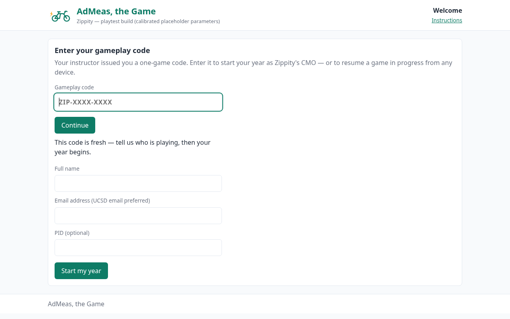{fig-align="center" height="340px"}

::: {.callout-note appearance="minimal"}
Apply your understanding in AdMeas the Game. You're Zippity's first CMO, tasked with advertising budgets and measurement, to maximize company profit. Allocate money to two ad types in six channels, informed by attribution, experiments and MMM. Gameplay requires a code--students get it on [Canvas](https://rady.instructure.com/){target="_blank"}, anyone else can get one by messaging [Ken on LinkedIn](https://www.linkedin.com/in/kennethcwilbur){target="_blank"}.
:::

::: {.source-url}
[https://admeas-game.kennethcwilbur.workers.dev](https://admeas-game.kennethcwilbur.workers.dev){target="_blank"}
:::

## Acknowledgements

- Joel Barajas, Rick Bruner, Peter Daboll, Tom Flanagan, Carl Mela, Prabhath Nanisetty, and Koen Pauwels for helpful comments
- Colleagues and students who helped improve earlier versions
- Benedict Evans for inspiring the assertion-evidence slide format; McDermott & Butts for the quarto theme
